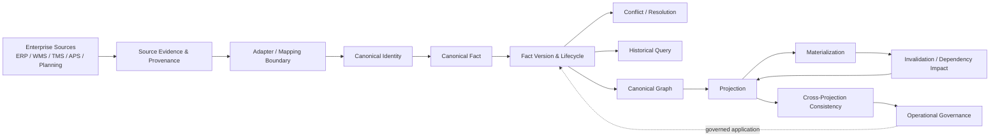
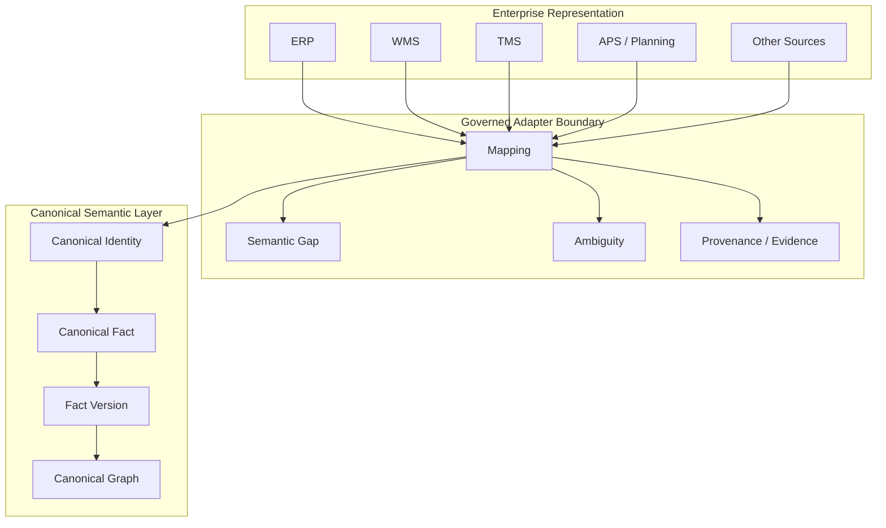
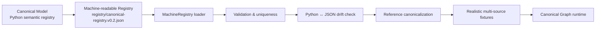
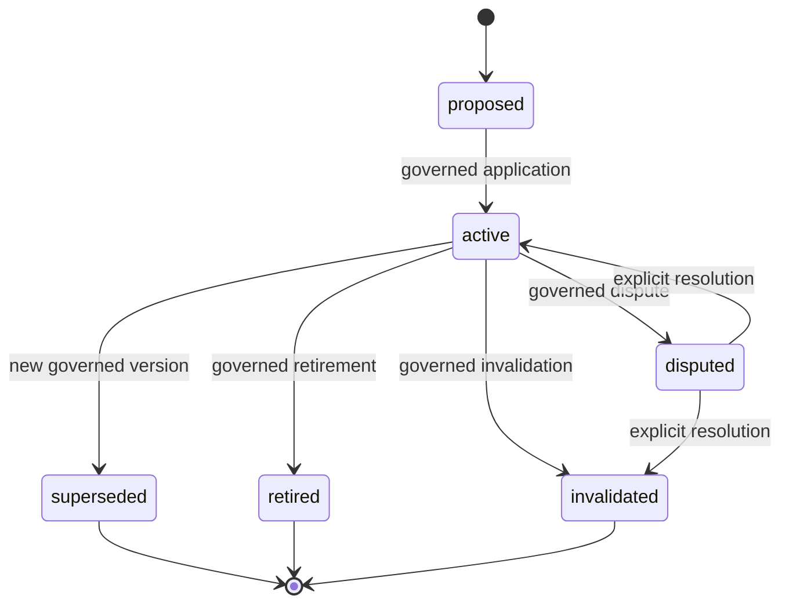
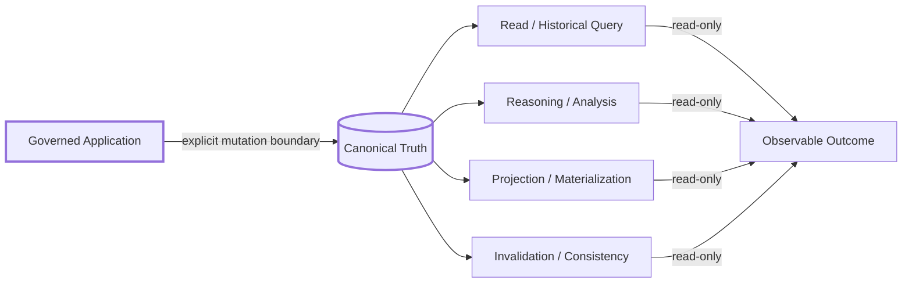
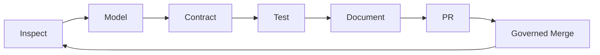

# SCM Ontology

> **サプライチェーン管理のためのフレームワーク非依存のカノニカル意味モデル — エンタープライズデータ、カノニカルファクト、グラフ推論、プロジェクション、将来のSCM OS実装を接続するために設計されました。ソースシステムの意味論が黙って真実になることは許しません。**

[](https://github.com/miumigy/scm-ontology/actions)

**[English](./README.md) | 日本語**

## このプロジェクトが存在する理由

エンタープライズSCMデータは豊かですが断片化しています。ERP、WMS、TMS、APS、計画、流通、調達、製造、分析システムは、それぞれ独自の識別子・意味論・時間（時制）ルール・前提を持っています。

SCM Ontology は、そうした表現と下流のグラフ／推論アプリケーションの間をつなぐ**意味論的コントロールプレーン**（semantic control plane）を提供します。

中央の設計原則は次の通りです:

> **Canonical Truth は統治されます。マッピング、類似度、推論、プロジェクション、または取り込みの成功によって暗黙に生成されることは決してありません。**

## SCM Ontology とは

**SCM Ontology** は、サプライチェーン管理のためのフレームワーク非依存の Canonical Semantic Model（正規意味モデル）です。サプライチェーンを記述するカノニカルなエンティティ、リレーションシップ、イベント、状態、制約、意思決定、KPI、リスクを、ERP / WMS / TMS / APS / 計画ベンダーの語彙に依存せず定義します。これは、エンタープライズエビデンスがマッピングされる**統治された語彙**であり、異種ソースシステムが単一のソースに黙って「真」になることなく、一緒に推論できるようにします。

## SCM OS とは

**SCM OS**（supply-chain operating system）は、カノニカルモデルの上に載る統治されたオペレーティングレイヤーです。Canonical Facts と Canonical Graph の状態を、説明可能なビジネス意思決定へ変換します:

```text
エンタープライズエビデンス → 統治されたカノニカル化 → Canonical Graph / State
→ ビジネス質問 → 説明可能な推論 → シミュレーション / 最適化
→ 承認 / 統治 → 実行 → アウトカム → Canonical Event
→ 次の意思決定
```

SCM OS は状態・統治・承認・実行境界・監査を所有します。AIとエージェントは**推論または提案プロバイダとしてのみ**動作し、Canonical Truth を直接変更することはありません。

## 現在の状況

**リファレンスアーキテクチャと統治されたリファレンスランタイム: 完了 — Primary Launch / Release Candidate の準備中**

SCM Ontology の意味モデルと SCM OS Reference ランタイムは、以下を含む統治された認知的ループ全体をカバーします: 観測、意思決定コンテキスト構築、ルール・LLM推論プロバイダ、提案検証、承認・統治、実行（インメモリ・副作用フリー）、運用ワークフロー、監査・リプレイ、永続グラフバックエンド（リレーショナルと Neo4j）、閉ループ実行、参照データアダプタ、制約付き自律制御。

これは**参照品質**のリリースであり、すべての運用コネクタ・グラフデータベース・スケジューラ・インジェストエンジンが実装されたという主張ではありません。直近の目標は **Primary Launch / Release Candidate**（**SCM Ontology v0.1** / **SCM OS Reference v0.1**）です。

Golden Path と受入を実行します:

```bash
PYTHONPATH=src python -m scm_ontology.primary_launch --self-check
PYTHONPATH=src python -m scm_ontology.primary_launch_acceptance --self-check
```

歴史的な `Sxxx` / `Mxx` / `Px-x` 識別子は、マイルストーン文書にトレーサビリティ用に残されています。[ドキュメントマップ](#ドキュメントマップ) と [`docs/launch/`](docs/launch/README.md) が Primary Launch 表面を定義します。

## Quick Start（クイックスタート）

新しい環境で Primary Launch の Golden Path と受入を実行します:

```bash
python -m venv .venv
source .venv/bin/activate
pip install -r requirements-dev.txt

export PYTHONPATH=src
python -m scm_ontology.validator
python -m scm_ontology.primary_launch --self-check
python -m scm_ontology.primary_launch_acceptance --self-check
pytest -q
```

Golden Path は、統治されたリファレンスランタイムを1つの決定的・内容アドレス付きの結果に合成します。**外部への副作用はなく**、Canonical Truth の変異もありません。完全なストーリーは [`docs/launch/golden-path.md`](docs/launch/golden-path.md)、L5 受入チェックリストは [`docs/launch/acceptance.md`](docs/launch/acceptance.md) を参照して下さい。

リポジトリ内の開発者は、理解に約5分、実行に約10分、拡張に約30分で到達できます。

## アーキテクチャ概要



### 意味論的境界（semantic boundary）



**重要:** マッピングは変異ではありません。マッピング結果は、明示的な統治された適用ステップがカノニカル状態を作成または変更するまでの間、エビデンス付きの提案／結果です。

## 機械可読のカノニカルレジストリ



レジストリは**意味論（セマンティクス）の語彙の成果物**であり、ストレージスキーマではありません。安定したコンセプト識別子、概念レイヤー、世界レイヤー、説明、リレーションシップ述語、エンドポイント、カテゴリを捕捉します。同梱された成果物は `src/scm_ontology/canonical_model.py` に対して検証され、意味論のドリフトが目に見えない内容の不一致ではなく、テスト失敗になります。

[`registry/canonical-registry.v0.2.json`](registry/canonical-registry.v0.2.json) と [`docs/roadmap-post-m8.md`](docs/roadmap-post-m8.md) を参照して下さい。

## Canonical Truth ライフサイクル



すべてのファクトバージョンは、再構築に必要なプロヴェナンス（出自・履歴）、ソース識別、スコープ、時間（時制）基点、ライフサイクル履歴、統治判断を保持します。

## 読み取り / 派生 / 変異の境界



デフォルトは**読み取り専用**です。Canonical Truth を変更できる唯一の経路は、明示的・統治された適用ステップのみです。

## 開発履歴

詳細なマイルストーンとスライス契約（歴史的な `M8` / `Sxxx` 開発シーケンス）は、[`docs/milestones/`](docs/milestones/) と `docs/` 契約索引の下で保持されています。これらはエンジニアリング履歴であり、Primary Launch の表面ではありません。現在の製品の表面は [`docs/launch/`](docs/launch/README.md) によって定義されます。

## 非妥協の不変条件（Non-negotiable invariants）

1. **暗黙のカノニカル変異はしない** — マッピング、推論、クエリー、プロジェクション、リアライズ、無効化、リプレイ、リカバリは Canonical Truth を黙って変更しません。
2. **Canonical Truth ≠ 派生した真実** — 推論、集計、類似度、確信、プロジェクション結果は、Canonical Facts と区別できるまま保持されます。
3. **プロヴェナンスは保持される** — ソース識別子とエビデンスは、統治された結果に結び付けられたままです。
4. **履歴は保持される** — ファクトバージョン、ライフサイクル遷移、競合、解決、プロジェクション、無効化が再構築可能です。
5. **不確実性は保持される** — 未解決・競合・期限切れ・部分・失敗・サポートされていない・不明な結果は、観測可能なままです。
6. **リプレイは第一級の機能** — 統治された意思決定と実行が、履歴を黙って書き換えることなく、リプレイ可能です。
7. **スコープは明示的** — エンタープライズ、テナント、組織、製品などの境界は、決して暗黙に拡大されません。
8. **ベンダー意味論は Canonical Ontology の外に留まる** — 明示的に統治・バージョン化されない限り。

## このリポジトリが何か、そして何でないか

### これは

- カノニカルなSCM意味論モデルです。
- 統治される語彙とリレーションモデルです。
- エンタープライズカノニカル化のための契約層です。
- カノニカルグラフとグラフ推論の基礎です。
- プロジェクションとSCM OSアプリケーションの基礎です。
- 回帰テストで保護された実行可能な仕様です。

### これはまだ（Primary Launch 境界）

**SCM Ontology v0.1** / **SCM OS Reference v0.1** はリファレンス実装です。統治されたリファレンスアーキテクチャを実演しますが、次のことを**主張はしません**:

- 一般的な SAP / ERP / WMS / TMS / APS コネクタスイート;
- プロダクショングレードのグラフ DB 製品や本番 HA / SLA。
- エンタープライズ IAM / セキュリティ認証を行ったマルチテナント SaaS。
- 自律型オントロジー学習やグラフ書き込みエージェント。
- 制限のない自律実行または暗黙の外部副作用。
- マッピング、推論、プロジェクション、または取り込み成功だけでファクトが Canonical Truth になること。
- オプティマイザ / APS の代替品、またはプロダクションスケールのインジェスト / スケジューラ。

これらの明示的な境界は、リファレンスの主張を信頼できるものにする長所です。実際のエンタープライズ統合、マルチテナント展開、エンタープライズ IAM、観測性、性能・スケール、より豊かな SCM アプリは、ポストランチテーマです（[`BACKLOG.yaml`](BACKLOG.yaml) を参照）。

## ドキュメントマップ

| 領域 | エントリポイント |
|---|---|
| プロジェクト概要 | `README.md` |
| ドキュメント索引 | `docs/README.md` |
| 現在のアーキテクチャ | `docs/architecture/current-architecture.md` |
| 機械可読レジストリ | `registry/canonical-registry.v0.2.json` |
| レジストリローダー | `src/scm_ontology/machine_registry.py` |
| マイルストーンと受入 | `docs/milestones/` |
| M8 クロージャコントラクト | `docs/milestones/S310-m8-acceptance-closure.md` |
| 意味論的コントラクト | `docs/semantics/` and related contract documents |
| バックログ / 将来実装 | `BACKLOG.yaml` |
| エージェント開発ルール | `AGENTS.md` |
| Primary Launch 索引 | `docs/launch/README.md` |
| Golden Path | `docs/launch/golden-path.md` |

## 開発哲学



グリーンな CI は必要ですが十分ではありません。**テストは意味論的境界を保護するものであり、グリーンを得るためにテストを弱化することはできません。**

## ロードマップ

開発は、無制限の `Sxxx` / `Mxx` / `Phase-x-x` 識別子シーケンスではなく **リリース指向**で管理されます。現行の目標は:

- **SCM Ontology v0.1** / **SCM OS Reference v0.1** — Primary Launch / Release Candidate。統治されたリファレンスアーキテクチャは完了です（[開発履歴](#開発履歴) を参照）。ローンチスライスは Golden Path と L5 受入です。

ポストローンチのリリースは `v0.1.0`、`v0.2.0`、`v0.3.0` として進められます。新しい機能作業は新しいロードマップに基づいて再ベースライン化されます。[`docs/primary-launch-handoff.md`](docs/primary-launch-handoff.md) で正式なハンドオフと非主張を参照して下さい。

## コントリビューション

- 最初に [`AGENTS.md`](AGENTS.md) を読んで下さい。非妥協の不変条件（Canonical Truth 境界・プロヴェナンス・統治・リプレイ）をエンコードしています。
- ポストランチアイデアのために新しい Phase を開始したり、新規 `Sxxx` 番号を発行したりしないで下さい。まずそれが **Primary Launch ブロッカー**なのか、**Important** なリリース前の改善なのか、**ポストランチのバックログ**なのかを判断して下さい（[`BACKLOG.yaml`](BACKLOG.yaml) に記録）。
- 新しい契約を導入するよりも既存の統治された契約を合成することを優先して下さい。
- スキーマまたは契約の変更には、検証とテストが必要です。CI をグリーンにするためにテストや受入条件を弱化しないで下さい。
- ブランチフローに従って下さい: `main` → 焦点を絞った機能ブランチ → CI → PR → レビュー → 統治されたマージ。

---
*この日本語版は、英語版 [`README.md`](./README.md) の翻訳です。用語の不整合がある場合、英語版を正とします。*
