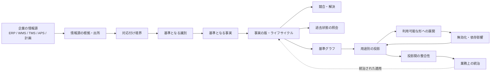
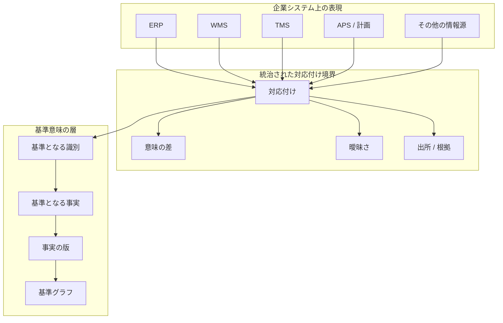
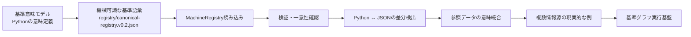
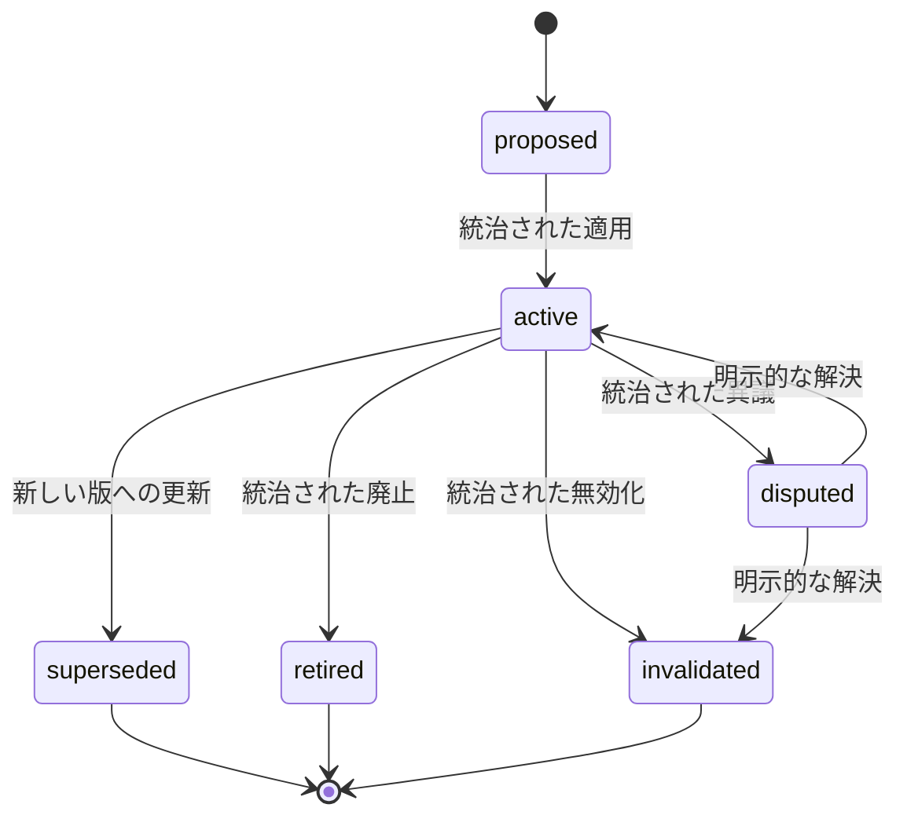
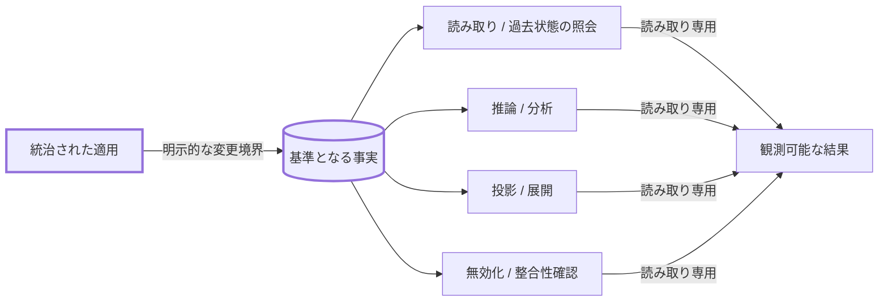
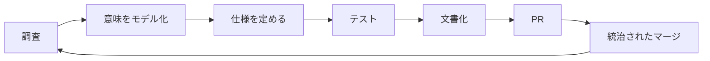

# SCM Ontology

> **サプライチェーン・マネジメント（SCM）のための、特定の業界・企業・ERP・WMS・TMS・計画製品などに依存しない意味モデルです。企業の根拠情報を共通の意味で扱い、基準となる情報・グラフ・推論・投影、そしてSCM OSへつなげることを目的とします。**

[](https://github.com/miumigy/scm-ontology/actions)

**[English](./README.md) | 日本語**

## なぜこのプロジェクトなのか

企業のSCMデータは豊富ですが、ERP、WMS、TMS、APS、計画、物流、調達、製造、分析などのシステムごとに、識別子、意味、時間の扱い、前提条件が異なります。

そのため、システム間のデータをつないでも、**「そのデータがSCM上で何を意味するのか」**が統一されないまま、個別システムの意味が事実上の正解になってしまいます。

SCM Ontologyは、こうした表現の違いと、その先のグラフ・推論アプリケーションの間に、**意味を統制するための境界**を置きます。

中心となる原則は次の一文です。

> **基準となる事実は統治された手続きを経て成立する。対応付け、類似性、推論、投影、取り込みが成功しただけで、暗黙に基準となる事実へ変更してはいけない。**

## SCM Ontologyとは

SCM Ontologyは、特定の企業、業界、製品、ERP / WMS / TMS / APSなどの用語体系から独立して、サプライチェーンを表す**対象、関係、出来事、状態、制約、意思決定、KPI、リスク**などを定義する、機械可読な基準意味モデルです。

企業の根拠情報をこのモデルへ対応付けることで、異なるシステムから得られた情報を共通の意味で扱い、同じSCM上の対象について一緒に推論できるようにします。

重要なのは、**対応付けたことと、基準となる事実として認めたことを分ける**ことです。

```text
企業システムの情報
        ↓
情報源・出所・根拠を保持
        ↓
対応付け・意味の差・曖昧さを確認
        ↓
基準意味モデル上の識別
        ↓
基準となる事実・関係
        ↓
グラフ・問い・推論・投影
```

## SCM OSとは

SCM OSは、SCM Ontologyの上に構築される**統治されたSCM運用レイヤー**です。

SCMの状態を観測し、意思決定に必要な文脈を組み立て、説明可能な推論を行い、シミュレーションや最適化によって代替案を比較し、承認・統治を経て実行し、その結果を記録して次の意思決定につなげます。

```text
企業の根拠情報
 ↓
統治された意味統合
 ↓
基準グラフ / 状態
 ↓
SCM上の問い
 ↓
説明可能な推論
 ↓
シミュレーション / 最適化
 ↓
承認 / 統治
 ↓
実行
 ↓
結果 / 出来事
 ↓
次の意思決定
```

SCM OSは、状態、統治、承認、実行境界、監査を担います。AIやエージェントは**推論・分析・提案を行う役割**を担いますが、基準となる事実を直接変更する権限を持ちません。

## 現在の状態

**SCM Ontologyの意味モデルと、統治されたSCM OSリファレンス実装は、一次公開に必要な基盤を完成しています。**

リファレンス実装では、観測、意思決定の文脈構築、ルールおよびLLMによる推論、提案の検証、承認・統治、外部副作用を伴わない実行、業務ワークフロー、監査・再現、永続グラフ基盤（リレーショナル / Neo4j）、閉ループ実行、複数情報源の参照データ対応、限定された自律制御までを一つの統治された流れとして扱えます。

これは**本番向けの全コネクタや全グラフ基盤を実装済みだという意味ではありません**。v0.1.0は、SCM OntologyとSCM OSの考え方を第三者が理解・実行・拡張できるようにした、リファレンス品質の公開版です。

## 一次公開：v0.1.0

**SCM Ontology v0.1.0 / SCM OS Reference v0.1.0** を、最初の公開リファレンス実装としてリリースしました。

一次公開の目的は、すべての企業システムを本番接続することではありません。

> **SCMの意味を統一するための考え方と、それを守りながら動作するリファレンス実装を、第三者が理解・実行・拡張できる状態にすること。**

### 5分で理解 → 10分で実行 → 30分で拡張

一次公開では、内部の多数の開発番号を追うのではなく、1本の標準実行経路を入口にします。

```text
基準グラフを読み込む
→ SCM上の問いを立てる
→ 例外を検出・確認する
→ 統治された意思決定を作る
→ 根拠と理由を確認する
→ 代替案をシミュレーション / 最適化する
→ 承認する
→ 副作用のない形で実行する
→ 業務ワークフローを確認する
→ 監査・再現を確認する
→ エージェントによる限定された代替案を確認する
```

実行：

```bash
PYTHONPATH=src python -m scm_ontology.primary_launch --self-check
```

結果をJSONで確認：

```bash
PYTHONPATH=src python -m scm_ontology.primary_launch --json
```

標準実行経路の詳細：[`docs/launch/golden-path.md`](docs/launch/golden-path.md)

## クイックスタート

新しい環境から一次公開の標準実行経路と受入確認を実行できます。

```bash
python -m venv .venv
source .venv/bin/activate
pip install -r requirements-dev.txt

export PYTHONPATH=src
python -m scm_ontology.validator
python -m scm_ontology.primary_launch --self-check
python -m scm_ontology.primary_launch_acceptance --self-check
pytest -q
```

標準実行経路は、統治されたリファレンス実装を一つの決定的な結果にまとめます。外部への副作用はなく、基準となる事実を暗黙に変更しません。

## アーキテクチャの概要



### 意味の境界



**重要：対応付けは変更ではありません。** 対応付けの結果は、根拠情報を伴う結果として扱われ、明示的な統治された適用を経て初めて基準となる状態を変更できます。

## 機械可読な基準語彙



このJSONは**データベースの保存形式ではなく、SCMの意味を表す語彙・関係の成果物**です。安定した概念ID、概念上の層、世界の層、説明、関係の述語、関係する対象、分類などを定義します。

チェックインされたJSONは `src/scm_ontology/canonical_model.py` と検証され、意味のずれが目に見えないまま蓄積するのではなく、テストの失敗として検出されます。

詳細：[`registry/canonical-registry.v0.2.json`](registry/canonical-registry.v0.2.json)

## 基準となる事実のライフサイクル



各事実の版には、再構築に必要な**出所、情報源の識別、適用範囲、時間的な基準、ライフサイクル履歴、統治上の判断**を保持します。

## 読み取り・導出・変更の境界



原則として**読み取り専用**です。基準となる事実を変更できるのは、明示的な統治された適用だけです。

## 開発履歴

これまでの開発では、`M8`や`Sxxx`などの詳細な開発単位を使って、意味定義、実行境界、受入条件を積み上げてきました。

これらは**開発履歴として保持**しますが、一次公開後の製品開発では、無制限に新しい `Sxxx`、`Mxx`、`Phase` を増やすことはしません。現在の製品面は [`docs/launch/`](docs/launch/README.md) で定義します。

## 基準となる事実を守るための、変えてはいけない原則

1. **基準となる事実を暗黙に変更しない** — 対応付け、推論、照会、投影、展開、無効化、再現、復旧などによって勝手に変更しません。
2. **基準となる事実と派生結果を区別する** — 推論、集計、類似性、信頼度、投影などの結果を基準となる事実と混同しません。
3. **出所を残す** — 情報源と根拠を統治された結果に付けたままにします。
4. **履歴を残す** — 事実の版、ライフサイクル、競合、解決、投影、無効化を再構築できるようにします。
5. **不確実性を残す** — 未解決、競合、古い、部分的、失敗、未対応、不明などを観測可能にします。
6. **再現を第一級の機能として扱う** — 統治された意思決定と実行を、履歴を書き換えずに再現できるようにします。
7. **適用範囲を明示する** — 企業、テナント、組織、商品などの境界を暗黙に広げません。
8. **ベンダー固有の意味を基準意味モデルへ持ち込まない** — 必要な場合は明示的に統治し、版管理します。

## このリポジトリが提供するもの／提供しないもの

### 提供するもの

- SCMの基準意味モデル
- 統治された語彙と関係モデル
- 企業情報を基準意味へ対応付けるための境界
- 基準グラフとグラフ推論の基盤
- 用途別の投影とSCM OSアプリケーションの基盤
- 回帰テストで守られる実行可能な仕様

### 一次公開時点で提供を主張しないもの

**SCM Ontology v0.1.0 / SCM OS Reference v0.1.0** はリファレンス実装です。統治されたリファレンス・アーキテクチャを実証しますが、以下を主張しません。

- SAP / ERP / WMS / TMS / APSの汎用本番コネクタ群
- 本番規模のグラフデータベース製品、高可用性、SLA
- マルチテナントSaaS、企業向け認証、セキュリティ認証
- 自律的に意味を学習してグラフへ書き込むエージェント
- 制約のない自律実行や暗黙の外部副作用
- 対応付け、推論、投影、取り込みが成功しただけで基準となる事実になる仕組み
- Optimizer / APSの代替、または本番規模の取り込み・スケジューラ

この明確な境界は弱点ではありません。**何を実証し、何をまだ実証していないかを明確にすることで、一次公開の主張を信頼できるものにします。**

本番統合、マルチテナント展開、企業認証、監視、性能・規模、より豊富なSCMアプリケーションは一次公開後のテーマです。

## ドキュメントマップ

| 領域 | 入口 |
|---|---|
| プロジェクト概要 | `README.md` / `README.ja.md` |
| ドキュメント一覧 | `docs/README.md` |
| 現在のアーキテクチャ | `docs/architecture/current-architecture.md` |
| 機械可読な基準語彙 | `registry/canonical-registry.v0.2.json` |
| 基準語彙ローダー | `src/scm_ontology/machine_registry.py` |
| マイルストーン・受入条件 | `docs/milestones/` |
| M8完了契約 | `docs/milestones/S310-m8-acceptance-closure.md` |
| 意味に関する仕様 | `docs/semantics/` および関連文書 |
| バックログ / 今後の実装 | `BACKLOG.yaml` |
| エージェント開発ルール | `AGENTS.md` |
| 一次公開インデックス | `docs/launch/README.md` |
| 標準実行経路 | `docs/launch/golden-path.md` |

## 開発の考え方



Green CIは必要条件ですが十分条件ではありません。**CIをGreenにするためにテストや受入条件を弱めるのではなく、意味の境界を守るためにテストを使います。**

## ロードマップ

開発は、無制限の内部 `Sxxx` / `Mxx` / `Phase-x-x` 番号ではなく、**リリース単位**で管理します。

現在の公開版は、

- **SCM Ontology v0.1.0 / SCM OS Reference v0.1.0** — 一次公開済み

です。

一次公開後は、必要な能力をあらためて整理し、`v0.2.0`、`v0.3.0` …というリリース単位で進めます。一次公開後の判断基準と引き継ぎ事項は [`docs/primary-launch-handoff.md`](docs/primary-launch-handoff.md)、将来の作業は [`BACKLOG.yaml`](BACKLOG.yaml) を参照してください。

## 貢献

- 最初に [`AGENTS.md`](AGENTS.md) を読んでください。基準となる事実の境界、出所、統治、再現性などの重要原則を定義しています。
- 一次公開後のアイデアに対して、新しいPhaseや`Sxxx`番号を作ることから始めないでください。まず**一次公開の阻害要因**、**重要な改善**、**一次公開後のバックログ**のどれかに分類し、必要なら [`BACKLOG.yaml`](BACKLOG.yaml) に記録してください。
- 新しい仕様を作る前に、既存の統治された仕様を組み合わせて解決できないかを検討してください。
- スキーマや仕様を変更するときは、検証とテストを追加してください。CIをGreenにするためにテストや受入条件を弱めないでください。
- ブランチ運用は `main` → 集中した機能ブランチ → CI → PR → レビュー → 統治されたマージ、を基本とします。

## ライセンス

このプロジェクトは[MIT License](./LICENSE)の下で公開されています。

Copyright (c) 2026 miumigy.
