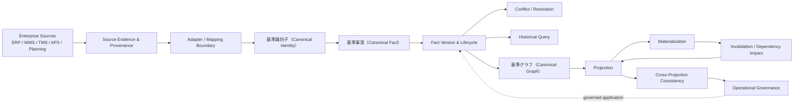
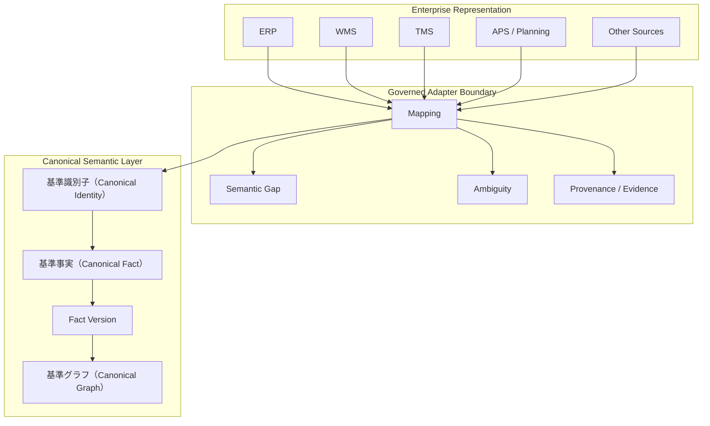
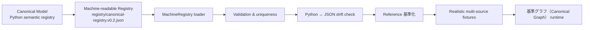
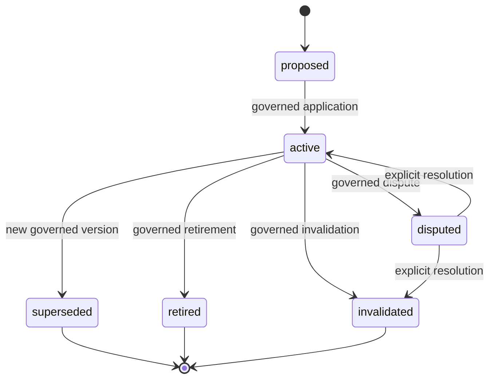
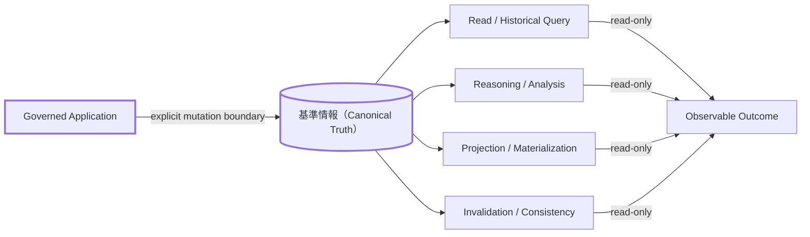
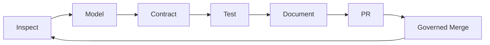

# SCM Ontology

> **サプライチェーン・マネジメント（SCM）のためのフレームワーク非依存の基準意味モデル（基準意味モデル（Canonical Semantic Model））です。企業データ、基準事実（Canonical Fact）、グラフ推論、Projection、そして将来のSCM OS実装を接続しつつ、ソースシステム固有の意味論が暗黙に「真実」になることを防ぎます。**

[](https://github.com/miumigy/scm-ontology/actions)

**[English](./README.md) | 日本語**

## このプロジェクトが存在する理由

企業のSCMデータは豊富である一方、分断されています。ERP、WMS、TMS、APS、計画、物流、調達、製造、分析などの各システムは、それぞれ固有の識別子、意味論、時間的ルール、前提条件を持っています。

SCM Ontologyは、これらの異なる表現と、その下流にあるグラフ／推論アプリケーションの間に位置する、**意味論的コントロールプレーン（semantic control plane）**を提供します。

中心となる設計原則は次のとおりです。

> **基準情報（基準情報（Canonical Truth））は統治されるものであり、マッピング、類似度計算、推論、Projection、またはデータ取り込みが成功したことだけを理由として、暗黙に生成されることはありません。**

## SCM Ontologyとは

**SCM Ontology**は、サプライチェーン・マネジメントのためのフレームワーク非依存の基準意味モデル（Canonical Semantic Model）です。サプライチェーンを記述する基準エンティティ、関係、イベント、状態、制約、意思決定、KPI、リスクを、特定のERP / WMS / TMS / APSや計画製品の語彙から独立して定義します。

これは、企業内のエビデンスを対応付けるための**統治された語彙（governed vocabulary）**です。異なるソースシステムの情報を共通の意味空間で扱い、特定のソースシステムが暗黙に「正解」になることなく、相互に推論できるようにします。

## SCM OSとは

**SCM OS**（supply-chain operating system）は、基準意味モデルの上に構築される**統治されたオペレーティングレイヤー**です。基準事実（Canonical Fact）と基準グラフ（Canonical Graph）の状態を、説明可能なビジネス意思決定へ変換します。

```text
企業エビデンス → 統治された基準化 → 基準グラフ（Canonical Graph） / State
→ ビジネス・クエスチョン → 説明可能な推論 → シミュレーション / 最適化
→ 承認 / ガバナンス → 実行 → 結果 → 基準イベント（Canonical Event）
→ 次の意思決定
```

SCM OSは、状態、ガバナンス、承認、実行境界、監査を担います。AIやエージェントは**推論または提案を提供するプロバイダとしてのみ**動作し、基準情報を直接変更することはありません。

## 現在の状況

**リファレンス・アーキテクチャと統治されたリファレンス・ランタイム：完成 — Primary Launch / Release Candidateの準備段階**

SCM Ontologyの意味モデルとSCM OS Referenceランタイムは、統治された認知ループ全体をカバーしています。具体的には、観測、意思決定コンテキストの構築、ルール／LLMによる推論プロバイダ、提案の検証、承認／ガバナンス、実行（インメモリかつ副作用なし）、業務ワークフロー、監査／リプレイ、永続グラフ・バックエンド（リレーショナルおよびNeo4j）、クローズドループ実行、リファレンス・データ・アダプタ、制約付き自律制御などです。

これは**リファレンス実装としての品質を示すリリース**であり、あらゆる本番用コネクタ、グラフデータベース、スケジューラ、データ取り込みエンジンが実装済みであることを意味しません。次の目標は **Primary Launch / Release Candidate**（**SCM Ontology v0.1** / **SCM OS Reference v0.1**）です。

Primary LaunchのGolden Pathと受入検証は、次のコマンドで実行できます。

```bash
PYTHONPATH=src python -m scm_ontology.primary_launch --self-check
PYTHONPATH=src python -m scm_ontology.primary_launch_acceptance --self-check
```

過去の開発で使用した `Sxxx`、`Mxx`、`Px-x` の識別子は、トレーサビリティのためマイルストーン文書に残しています。現在のPrimary Launchの対象範囲については、[ドキュメント・マップ](#ドキュメントマップ) と [`docs/launch/`](docs/launch/README.md) を参照してください。

## Quick Start（クイックスタート）

新しい環境でPrimary LaunchのGolden Pathと受入検証を実行します。

```bash
python -m venv .venv
source .venv/bin/activate
pip install -r requirements-dev.txt

export PYTHONPATH=src
python -m scm_ontology.validator
python -m scm_ontology.primary_launch --self-check
python -m scm_ontology.primary_launch_acceptance --self-check
pytest -q
```

Golden Pathは、統治されたリファレンス・ランタイムを、決定的かつ内容アドレス付きの1つの結果へ組み立てます。**外部への副作用は発生せず、基準情報も変更しません。** 詳細なシナリオは [`docs/launch/golden-path.md`](docs/launch/golden-path.md)、L5受入チェックリストは [`docs/launch/acceptance.md`](docs/launch/acceptance.md) を参照してください。

リポジトリ内で開発する利用者であれば、概念の理解に約5分、実行に約10分、拡張に約30分で到達できることを目指しています。

## アーキテクチャ概要



### 意味論的境界（Semantic Boundary）



**重要：Mapping（マッピング）はMutation（状態変更）ではありません。** マッピング結果は、明示的な統治された適用ステップによって基準状態（Canonical State）が作成・変更されるまでは、エビデンスを伴う提案／結果として扱われます。

## 機械可読な基準レジストリ



レジストリは**意味論上の語彙を定義する成果物であり、ストレージ・スキーマではありません。** 安定した概念識別子、概念レイヤー、世界レイヤー、説明、関係述語、エンドポイント、カテゴリなどを保持します。リポジトリに格納されたレジストリは `src/scm_ontology/canonical_model.py` と照合・検証されるため、意味論のドリフトは見えにくいドキュメント不整合ではなく、テスト失敗として検出されます。

[`registry/canonical-registry.v0.2.json`](registry/canonical-registry.v0.2.json) と [`docs/roadmap-post-m8.md`](docs/roadmap-post-m8.md) を参照してください。

## 基準情報（Canonical Truth）のライフサイクル



すべてのFact Versionは、再構築に必要となるプロヴェナンス（出所・証跡）、ソース識別情報、スコープ、時間的基準、ライフサイクル履歴、ガバナンス上の判断を保持します。

## 読み取り・派生・変更の境界



基本姿勢は**読み取り専用（read-only）**です。基準情報（Canonical Truth）を変更できる唯一の経路は、明示的かつ統治された適用ステップです。

## 開発履歴

詳細なマイルストーンとスライス契約（過去の `M8` / `Sxxx` 開発シーケンス）は、[`docs/milestones/`](docs/milestones/) および `docs/` の契約インデックスに保存されています。これらはエンジニアリング上の開発履歴であり、Primary Launchの主要な表面ではありません。現在のプロダクトとしての表面は [`docs/launch/`](docs/launch/README.md) で定義されています。

## 非妥協の不変条件（Non-negotiable Invariants）

1. **基準情報を暗黙に変更しない** — Mapping、Reasoning、Query、Projection、Materialization、Invalidation、Replay、Recoveryは、基準情報（Canonical Truth）を黙って変更しません。
2. **基準情報と派生結果を混同しない** — 推論、集計、類似度、確信度、Projectionの結果は、基準事実（Canonical Fact）とは区別されたまま保持されます。
3. **Provenanceを失わない** — ソース識別情報とエビデンスは、統治された結果に紐付いたまま保持されます。
4. **履歴を失わない** — Fact Version、ライフサイクル遷移、競合、解決、Projection、Invalidationを再構築できます。
5. **不確実性を失わない** — 未解決、競合、陳腐化、一部欠損、失敗、未サポート、不明といった結果を観測可能な状態に保ちます。
6. **Replayを第一級の機能とする** — 統治された意思決定と実行は、履歴を暗黙に書き換えることなく再現できます。
7. **Scopeを明示する** — Enterprise、Tenant、Organization、Productなどの境界を暗黙に拡張しません。
8. **ベンダー固有の意味論をCanonical Ontologyの外に置く** — 明示的にガバナンス対象とし、バージョン管理しない限り、ベンダー固有の意味論をCanonical Ontologyへ持ち込みません。

## このリポジトリが提供するもの／提供しないもの

### 提供するもの

- カノニカルなSCM意味モデル
- 統治された語彙と関係モデル
- 企業データを基準化するための契約レイヤー
- 基準グラフ（Canonical Graph）とグラフ推論の基盤
- ProjectionとSCM OSアプリケーションの基盤
- 回帰テストによって保護された実行可能な仕様（executable specification）

### 現時点では提供しないもの（Primary Launchの境界）

**SCM Ontology v0.1** / **SCM OS Reference v0.1** はリファレンス実装です。統治されたリファレンス・アーキテクチャを実証するものであり、以下を提供済みであるとは主張しません。

- SAP / ERP / WMS / TMS / APSの汎用コネクタ・スイート
- 本番規模のグラフデータベース製品、または本番HA / SLA
- マルチテナントSaaS、エンタープライズIAM、セキュリティ認証
- 自律的なOntology学習エージェント、またはグラフへ直接書き込むエージェント
- 無制限の自律実行、または暗黙の外部副作用
- Mapping、Inference、Projection、Ingestionが成功しただけで、データが基準情報（Canonical Truth）になる仕組み
- Optimizer / APSの代替製品、または本番規模のIngestion / Scheduler

これらの境界を明確にすることは弱点ではなく、リファレンス実装としての主張の信頼性を高めるための重要な設計です。実際の企業システム連携、マルチテナント展開、エンタープライズIAM、運用監視、性能・スケール対応、より高度なSCMアプリケーションは、Primary Launch後のテーマです（[`BACKLOG.yaml`](BACKLOG.yaml) を参照）。

## ドキュメント・マップ

| 領域 | エントリーポイント |
|---|---|
| プロジェクト概要 | `README.md` |
| ドキュメント・インデックス | `docs/README.md` |
| 現行アーキテクチャ | `docs/architecture/current-architecture.md` |
| 機械可読レジストリ | `registry/canonical-registry.v0.2.json` |
| レジストリ・ローダー | `src/scm_ontology/machine_registry.py` |
| マイルストーンと受入 | `docs/milestones/` |
| M8クローズ契約 | `docs/milestones/S310-m8-acceptance-closure.md` |
| Semantic Contracts | `docs/semantics/` および関連契約文書 |
| バックログ／将来実装 | `BACKLOG.yaml` |
| エージェント開発ルール | `AGENTS.md` |
| Primary Launchインデックス | `docs/launch/README.md` |
| Golden Path | `docs/launch/golden-path.md` |

## 開発思想



CIがGreenであることは必要条件ですが、十分条件ではありません。**テストはGreenにするために弱めるのではなく、意味論上の境界を守るために存在します。**

## ロードマップ

開発は、無制限に増加する内部管理番号 `Sxxx` / `Mxx` / `Phase-x-x` ではなく、**リリースを軸として管理します。** 現在の目標は次のとおりです。

- **SCM Ontology v0.1** / **SCM OS Reference v0.1** — Primary Launch / Release Candidate。統治されたリファレンス・アーキテクチャは完成しており（[開発履歴](#開発履歴)を参照）、ローンチ対象はGolden PathとL5受入です。

Primary Launch後は `v0.1.0`、`v0.2.0`、`v0.3.0` のようにリリース単位で進め、新しい機能開発をその時点で新しいロードマップに再定義します。正式な引き継ぎ方針と非主張事項については [`docs/primary-launch-handoff.md`](docs/primary-launch-handoff.md) を参照してください。

## Contributing

- 最初に [`AGENTS.md`](AGENTS.md) を読んでください。基準情報（Canonical Truth）境界、Provenance、Governance、Replayなどの非妥協の不変条件を定義しています。
- Post-launchのアイデアについて、新しいPhaseを開始したり、新しい `Sxxx` 番号を発行したりしないでください。まず、**Primary Launch Blocker**、**Importantなローンチ前改善**、**Post-launch Backlog** のどれに該当するかを判断し、必要に応じて [`BACKLOG.yaml`](BACKLOG.yaml) に記録してください。
- 新しい契約を導入する前に、既存の統治された契約を組み合わせて解決できないかを検討してください。
- すべてのSchema / Contract変更には検証とテストを追加してください。CIをGreenにするためにテストや受入条件を弱めてはいけません。
- ブランチ運用は `main` → 集中したFeature Branch → CI → PR → Review → Governed Merge の流れに従ってください。

## ライセンス

このプロジェクトは[MIT License](./LICENSE)の下で公開されています。

Copyright (c) 2026 miumigy.
