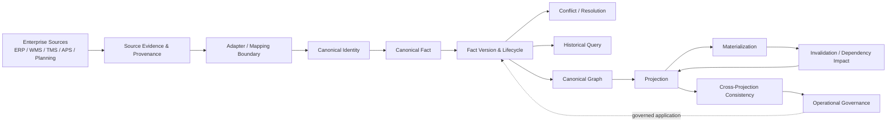
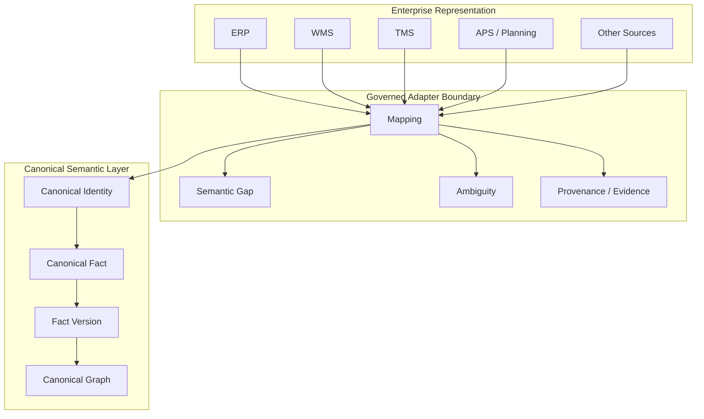
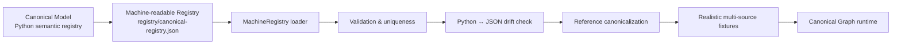
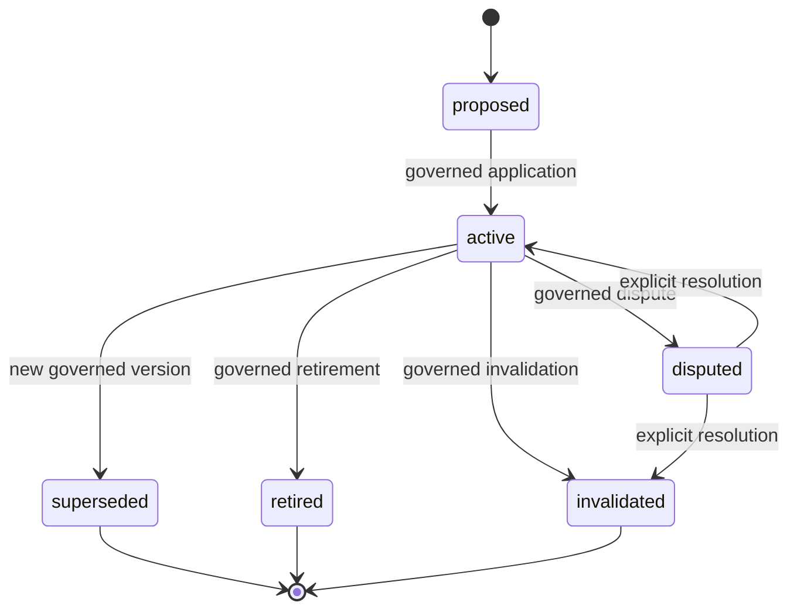
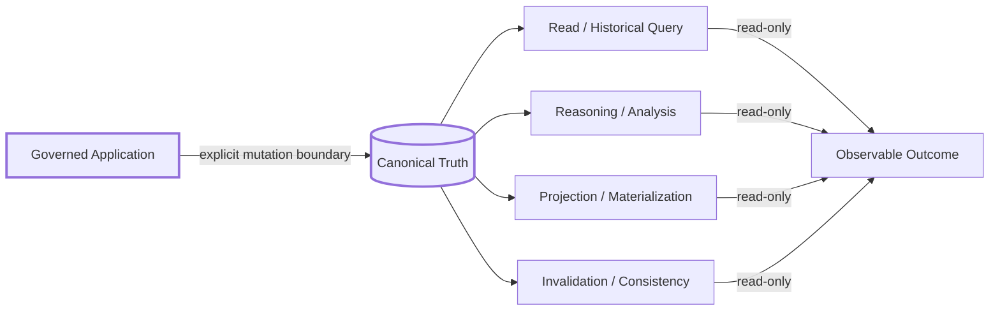
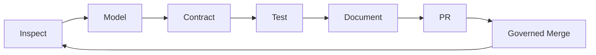

# SCM Ontology

> **A framework-independent Canonical Semantic Model for Supply Chain Management — designed to connect enterprise data, canonical facts, graph reasoning, projections, and future SCM OS implementations without letting source-system semantics silently become truth.**

[](https://github.com/miumigy/scm-ontology/actions)

**English** | [日本語](./README.ja.md)


## Why this project exists

Enterprise SCM data is rich but fragmented: ERP, WMS, TMS, APS, planning, logistics, procurement, manufacturing, and analytics systems each carry their own identifiers, semantics, temporal rules, and assumptions.

SCM Ontology provides a **semantic control plane** between those representations and downstream graph/reasoning applications.

The central design principle is:

> **Canonical Truth is governed; it is never created implicitly by mapping, similarity, inference, projection, or successful ingestion.**

## What is SCM Ontology?

**SCM Ontology** is a framework-independent Canonical Semantic Model for Supply Chain
Management. It defines the canonical entities, relationships, events, states,
constraints, decisions, KPIs, and risks that describe a supply chain, independent of
any ERP / WMS / TMS / APS / planning vendor vocabulary. It is the governed vocabulary
that enterprise evidence is mapped onto, so that heterogeneous source systems can be
reasoned about together without letting any one source silently become truth.

## What is SCM OS?

**SCM OS** (supply-chain operating system) is the governed operating layer that sits on
top of the canonical model. It turns Canonical Facts and Canonical Graph state into
explainable business decisions:

```text
Enterprise Evidence -> Governed Canonicalization -> Canonical Graph / State
-> Business Question -> Explainable Reasoning -> Simulation / Optimization
-> Authorization / Governance -> Execution -> Outcome -> Canonical Event
-> Next Decision
```

SCM OS owns state, governance, authorization, execution boundaries, and audit. AI and
agents act as **reasoning or proposal providers only**; they never directly mutate
Canonical Truth.


## Current status

**Reference architecture & governed reference runtime: COMPLETE — v0.1.0 Primary Launch Released.**

The SCM Ontology semantic model and the SCM OS Reference runtime now cover the
full governed cognitive loop — observation, decision context assembly, rule and
LLM reasoning providers, proposal validation, authorization/governance, execution
(in-memory, side-effect-free), operational workflow, audit/replay, persistent
graph backends (relational and Neo4j), closed-loop execution, reference data
adapters, and bounded autonomous control.

This is a **reference-quality** release, not a claim that every production
connector, graph database, scheduler, or ingestion engine has been implemented.
The **Primary Launch** is released as **SCM Ontology v0.1.0** /
**SCM OS Reference v0.1.0**.

Run the primary-launch Golden Path and acceptance:

```bash
PYTHONPATH=src python -m scm_ontology.primary_launch --self-check
PYTHONPATH=src python -m scm_ontology.primary_launch_acceptance --self-check
```

Historical development records retain legacy `Sxxx`, `Mxx`, and `Px-x`
identifiers where useful for traceability. See the [Documentation map](#documentation-map) and
[`docs/launch/`](docs/launch/README.md) for the primary-launch surface.

## Quick Start

Run the primary-launch Golden Path and acceptance in a fresh environment:

```bash
python -m venv .venv
source .venv/bin/activate
pip install -r requirements-dev.txt

export PYTHONPATH=src
python -m scm_ontology.validator
python -m scm_ontology.primary_launch --self-check
python -m scm_ontology.primary_launch_acceptance --self-check
pytest -q
```

The Golden Path composes the governed reference runtime into one deterministic,
content-addressed result with **no external side effects** and no mutation of
Canonical Truth. See [`docs/launch/golden-path.md`](docs/launch/golden-path.md) for the
full story and [`docs/launch/acceptance.md`](docs/launch/acceptance.md) for the L5
acceptance checklist.

A typical in-repo developer can reach understanding in ~5 minutes, execution in
~10 minutes, and extension in ~30 minutes.

## Architecture at a glance



### The semantic boundary



**Important:** Mapping is not mutation. A mapping result is an evidence-bearing proposal/outcome until an explicit governed application step creates or changes Canonical state.

## Machine-readable canonical registry



The registry is a **semantic vocabulary artifact**, not a storage schema. It captures stable concept identifiers, conceptual layers, world layers, descriptions, relationship predicates, endpoints, and categories. The checked-in artifact is validated against `src/scm_ontology/canonical_model.py`, so semantic drift becomes a test failure rather than an invisible documentation mismatch.

See [`registry/canonical-registry.json`](registry/canonical-registry.json) and [`docs/history/post-m8-roadmap.md`](docs/history/post-m8-roadmap.md).

## Canonical Truth lifecycle



Every Fact Version preserves provenance, source identity, scope, temporal basis, lifecycle history, and governing decisions needed for reconstruction.

## Read / derive / mutate boundaries



The default posture is **read-only**. The only path that may mutate Canonical Truth is an explicit, governed application step.

## Development history

The Phase 6–10 SCM OS reference build is preserved as engineering history under
[`docs/history/`](docs/history/), and the milestone and slice contracts (the
historical `M8`/`Sxxx` sequence) remain under [`docs/history/`](docs/history/).
They are development history, not the primary-launch surface; the current product
surface is defined by [`docs/launch/`](docs/launch/README.md).

## Non-negotiable invariants

1. **No implicit Canonical mutation** — mapping, reasoning, querying, projection, materialization, invalidation, replay, and recovery do not silently change Canonical Truth.
2. **Canonical Truth ≠ derived truth** — inference, aggregation, similarity, confidence, and projection results remain distinguishable from Canonical Facts.
3. **Provenance survives** — source identity and evidence remain attached to governed outcomes.
4. **History survives** — Fact Versions, lifecycle transitions, conflicts, resolutions, projections, and invalidations are reconstructable.
5. **Uncertainty survives** — unresolved, conflicted, stale, partial, failed, unsupported, and unknown outcomes remain observable.
6. **Replay is first-class** — governed decisions and executions are replayable without silently rewriting history.
7. **Scope is explicit** — enterprise, tenant, organization, product, and other boundaries are never expanded implicitly.
8. **Vendor semantics stay outside the Canonical Ontology** unless explicitly governed and versioned.

## What this repository is — and is not

### It is

- a canonical SCM semantic model;
- a governed vocabulary and relationship model;
- a contract layer for enterprise canonicalization;
- a foundation for canonical graphs and graph reasoning;
- a foundation for projections and SCM OS applications;
- an executable specification protected by regression tests.

### It is not yet (Primary Launch boundaries)

**SCM Ontology v0.1** / **SCM OS Reference v0.1** is a reference implementation.
It demonstrates the governed reference architecture; it does **not** claim:

- a universal SAP / ERP / WMS / TMS / APS connector suite;
- a production-scale graph database product or a production HA / SLA;
- a multi-tenant SaaS with enterprise IAM or security certification;
- an autonomous ontology-learning or graph-writing agent;
- unrestricted autonomous execution or implicit external side effects;
- that mapping, inference, projection, or ingestion success alone makes a fact
  Canonical Truth;
- an optimizer / APS replacement or production-scale ingestion / scheduler.

These explicit boundaries are a strength: they make the reference claims
credible. Real enterprise integration, multi-tenant deployment, enterprise
IAM, observability, performance/scale, and richer SCM applications are
post-launch themes (see [`BACKLOG.yaml`](BACKLOG.yaml)).

## Documentation map

| Area | Entry point |
|---|---|
| Project overview | `README.md` |
| Documentation index | `docs/README.md` |
| Current architecture | `docs/architecture/current-architecture.md` |
| Machine-readable registry | `registry/canonical-registry.json` |
| Registry loader | `src/scm_ontology/machine_registry.py` |
| Development history | `docs/history/` (phase archives and legacy development records) |
| SCM semantics | `docs/semantics/` |
| SCM OS operations | `docs/operations/` |
| Reference material | `docs/reference/` |
| Backlog / future implementation | `BACKLOG.yaml` |
| Agent development rules | `AGENTS.md` |
| Primary launch index | `docs/launch/README.md` |
| Golden Path | `docs/launch/golden-path.md` |

## Repository layout

The top-level directories have distinct, stable responsibilities. Keeping a
concept in one place is part of the product contract.

| Directory | Responsibility |
|---|---|
| `ontology/` | The SCM semantic model (entities, relationships, events, states, constraints, policies, decisions, KPIs, vocabulary). |
| `registry/` | Machine-readable canonical vocabulary and registration data (e.g. `canonical-registry.json`). |
| `schemas/` | Structural validation rules (JSON Schema) for canonical and interchange documents. |
| `fixtures/` | Test and regression-validation data (e.g. supply-dependency, inventory-capacity, multi-hop-supply-risk graphs). |
| `examples/` | Runnable reference examples that help a user understand and run the model. |
| `src/` | The Python implementation (package `scm_ontology`). |
| `tests/` | Regression tests that protect the semantic and governance boundaries. |
| `docs/` | Human-readable documentation (architecture, semantics, launch, history). |
| `mappings/` | Crosswalk artifacts (e.g. APICS/SCOR) kept separate from the canonical model. |

This layout mirrors the cognitive flow: `ontology/` defines meaning, `registry/`
makes it machine-readable, `schemas/` validates structure, `fixtures/` feed
regression and validation, and `examples/` show a user how to run it.

## Development philosophy



A green CI is necessary but not sufficient: **tests must protect semantic boundaries rather than weaken them to obtain a green build.**

## Roadmap

Development is managed **release-oriented**, not by an unbounded sequence of
internal `Sxxx` / `Mxx` / `Phase-x-x` identifiers. The current target is:

- **SCM Ontology v0.1.0** / **SCM OS Reference v0.1.0** — the **Primary
  Launch Released**. The governed reference architecture is complete (see
  [Development history](#development-history)); the launch slice is the Golden
  Path plus the L5 acceptance.

Post-launch releases can then proceed as `v0.1.0`, `v0.2.0`, `v0.3.0`, with new
capability work re-baselined against a fresh roadmap. See
[`docs/primary-launch-handoff.md`](docs/primary-launch-handoff.md) for the
authoritative handoff and non-claims.

## Contributing

- Read [`AGENTS.md`](AGENTS.md) first: it encodes the non-negotiable invariants
  (Canonical Truth boundary, provenance, governance, replay).
- Do not start a new Phase or mint new `Sxxx` numbers for a post-launch idea.
  Decide first whether it is a **Primary Launch blocker**, an **Important**
  pre-launch improvement, or **post-launch backlog** (record it in
  [`BACKLOG.yaml`](BACKLOG.yaml)).
- Prefer composing existing governed contracts over introducing new ones.
- Every schema/contract change needs validation and tests; do not weaken tests
  or acceptance conditions to make CI green.
- Follow the branch flow: `main` -> focused feature branch -> CI -> PR ->
  review -> governed merge.

## License

This project is licensed under the [MIT License](./LICENSE).

Copyright (c) 2026 miumigy.
