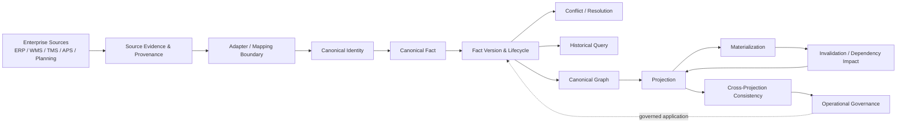
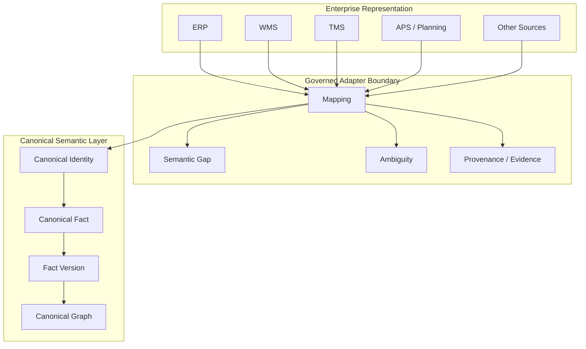
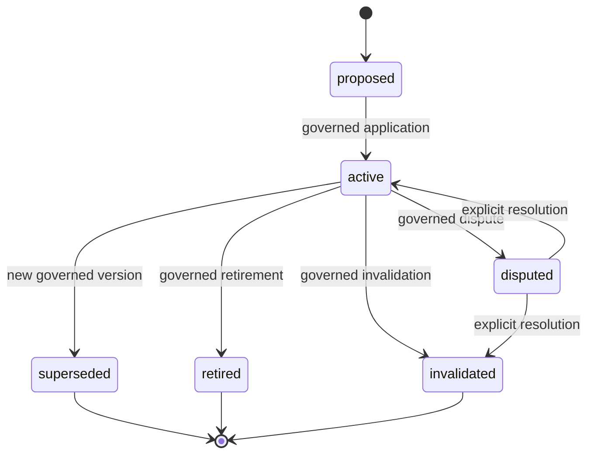
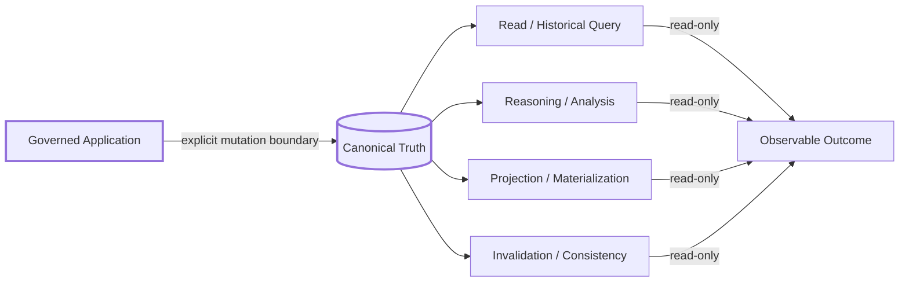

# SCM Ontology

> **A framework-independent Canonical Semantic Model for Supply Chain Management — designed to connect enterprise data, canonical facts, graph reasoning, projections, and future SCM OS implementations without letting source-system semantics silently become truth.**

[](https://github.com/miumigy/scm-ontology/actions)

## Why this project exists

Enterprise SCM data is rich but fragmented: ERP, WMS, TMS, APS, planning, logistics, procurement, manufacturing, and analytics systems each carry their own identifiers, semantics, temporal rules, and assumptions.

SCM Ontology provides a **semantic control plane** between those representations and downstream graph/reasoning applications.

The central design principle is:

> **Canonical Truth is governed; it is never created implicitly by mapping, similarity, inference, projection, or successful ingestion.**

## Current status

**M8 — Canonicalization & Projection Governance: COMPLETE**

M8 closes the semantic and operational contract from enterprise evidence through Canonical Facts, historical lifecycle, projections, invalidation, cross-projection consistency, and operational governance.

This is a **contract-complete** milestone, not a claim that every production connector, graph database, scheduler, or ingestion engine has been implemented.

## Architecture at a glance



### The semantic boundary



**Important:** Mapping is not mutation. A mapping result is an evidence-bearing proposal/outcome until an explicit governed application step creates or changes Canonical state.

## Canonical Truth lifecycle



Every Fact Version preserves provenance, source identity, scope, temporal basis, lifecycle history, and governing decisions needed for reconstruction.

## Read / derive / mutate boundaries



The default posture is **read-only**. The only path that may mutate Canonical Truth is an explicit, governed application step.

## M8 contract chain

M8 is organized around the following end-to-end chain:

```text
Source Evidence
      ↓
Adapter / Mapping
      ↓
Canonical Identity
      ↓
Canonical Fact
      ↓
Fact Version
      ↓
Conflict / Resolution
      ↓
Historical Query
      ↓
Projection
      ↓
Materialization
      ↓
Invalidation
      ↓
Cross-Projection Consistency
      ↓
Operational Governance
```

### M8 completed slices

| Slice | Contract | Status |
|---|---|---|
| S294 | Governed Conflict Resolution | ✅ |
| S300 | Canonical Fact Lifecycle & Versioning | ✅ |
| S301 | Canonical Fact Application & Version Transition | ✅ |
| S302 | Temporal & Historical Query | ✅ |
| S303 | Canonical Graph Read & Projection Boundary | ✅ |
| S304 | Projection Freshness & Lineage | ✅ |
| S305 | Governed Projection Query | ✅ |
| S306 | Governed Projection Materialization | ✅ |
| S307 | Projection Invalidation & Dependency Propagation | ✅ |
| S308 | Cross-Projection Consistency & Rebuild Boundary | ✅ |
| S309 | Operational Readiness & Governance | ✅ |
| S310 | M8 Acceptance & Closure | ✅ |

## Non-negotiable invariants

1. **No implicit Canonical mutation** — mapping, reasoning, querying, projection, materialization, invalidation, replay, and recovery do not silently change Canonical Truth.
2. **Canonical Truth ≠ derived truth** — inference, aggregation, similarity, confidence, and projection results remain distinguishable from Canonical Facts.
3. **Provenance survives** — source identity and evidence remain attached to governed outcomes.
4. **History survives** — Fact Versions, lifecycle transitions, conflicts, resolutions, projections, and invalidations are reconstructable.
5. **Uncertainty survives** — unresolved, conflicted, stale, partial, failed, unsupported, and unknown outcomes remain observable.
6. **Replay is first-class** — governed decisions and executions are replayable without silently rewriting history.
7. **Scope is explicit** — enterprise, tenant, organization, product, and other boundaries are never expanded implicitly.
8. **Vendor semantics stay outside the Canonical Ontology** unless explicitly governed and versioned.

## What this repository is — and is not

### It is

- a canonical SCM semantic model;
- a governed vocabulary and relationship model;
- a contract layer for enterprise canonicalization;
- a foundation for canonical graphs and graph reasoning;
- a foundation for projections and SCM OS applications;
- an executable specification protected by regression tests.

### It is not yet

- a universal ERP/WMS/TMS connector;
- a production-scale graph database product;
- an autonomous ontology-learning system;
- an autonomous graph-writing agent;
- an optimizer or APS replacement;
- a claim that inferred results are automatically true.

## Documentation map

| Area | Entry point |
|---|---|
| Project overview | `README.md` |
| Documentation index | `docs/README.md` |
| Architecture | `docs/architecture/` |
| Milestones & acceptance | `docs/milestones/` |
| M8 closure contract | `docs/milestones/S310-m8-acceptance-closure.md` |
| Semantic contracts | `docs/semantics/` and related contract documents |
| Backlog / future implementation | `BACKLOG.yaml` |
| Agent development rules | `AGENTS.md` |

## Development philosophy


A green CI is necessary but not sufficient: **tests must protect semantic boundaries rather than weaken them to obtain a green build.**

## Road ahead

M8 intentionally ends the contract-definition phase. The next phase should turn these stable boundaries into reference implementations and measurable SCM value:

1. machine-readable canonical ontology and registries;
2. reference canonicalization pipeline against realistic enterprise fixtures;
3. graph persistence and query implementation;
4. real multi-source identity resolution under governance;
5. SCM business-question applications;
6. integration with planning, simulation, and SCM OS capabilities;
7. production observability, performance, and operational controls.

Future implementation must preserve the M8 contracts rather than redefining them for convenience.
