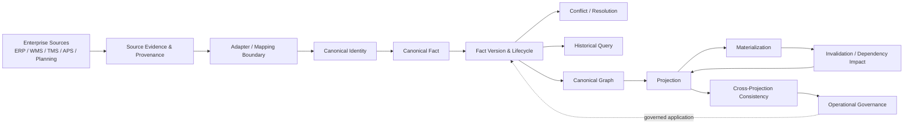
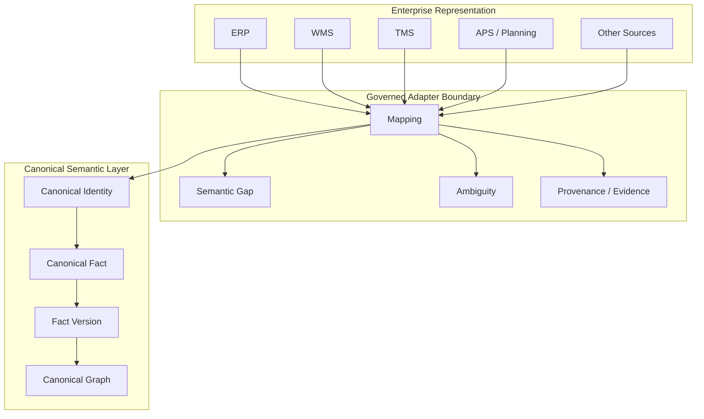
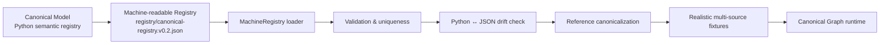
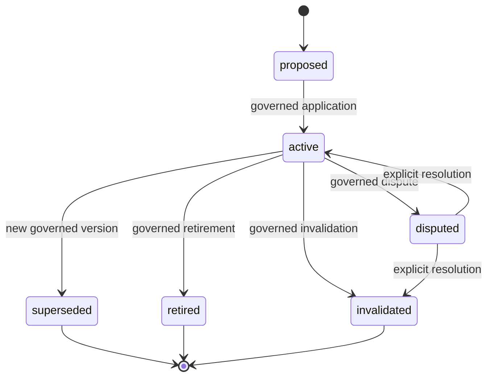
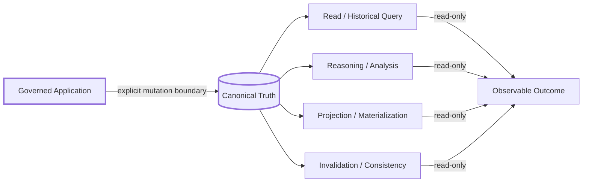

# SCM Ontology

> **A framework-independent Canonical Semantic Model for Supply Chain Management — designed to connect enterprise data, canonical facts, graph reasoning, projections, and future SCM OS implementations without letting source-system semantics silently become truth.**

[](https://github.com/miumigy/scm-ontology/actions)

## Why this project exists

Enterprise SCM data is rich but fragmented: ERP, WMS, TMS, APS, planning, logistics, procurement, manufacturing, and analytics systems each carry their own identifiers, semantics, temporal rules, and assumptions.

SCM Ontology provides a **semantic control plane** between those representations and downstream graph/reasoning applications.

The central design principle is:

> **Canonical Truth is governed; it is never created implicitly by mapping, similarity, inference, projection, or successful ingestion.**

## Current status

**M8 — Canonicalization & Projection Governance: COMPLETE**

M8 closes the semantic and operational contract from enterprise evidence through Canonical Facts, historical lifecycle, projections, invalidation, cross-projection consistency, and operational governance.

This is a **contract-complete** milestone, not a claim that every production connector, graph database, scheduler, or ingestion engine has been implemented.

**Post-M8 implementation: Machine-Readable Canonical Registry — ACTIVE**

The first implementation slice turns the established semantic registry into a checked-in machine-readable artifact and validates it against the Python canonical model without changing the M8 semantic boundary.
**SCM OS Runtime (Phase R1–R5) — COMPLETE through S366**

The governed cognitive loop — observations → ReasoningInput → ReasoningOutput → Proposal Validation → Authorization → ExecutionCommand — runs as a deterministic, in-memory, side-effect-free Python API ([`S348-decision-runtime.md`](docs/S348-decision-runtime.md)). Phase R2 adds the first real provider families to the S368 boundary: a deterministic rule-based provider ([`S351`](docs/S351-rule-reasoning-provider.md)) and an injected, transport-neutral LLM provider ([`S352`](docs/S352-llm-reasoning-provider.md)). Phase R3 adds an execution runtime ([`S353-execution-runtime.md`](docs/S353-execution-runtime.md)) that dry-runs an immutable `ExecutionCommand` through a bounded, injected adapter with no external side effects. Phase R4 adds governance ([`S354`](docs/S354-governed-audit.md) audit & replay, [`S355`](docs/S355-command-lifecycle.md) lifecycle, [`S356`](docs/S356-authorization-governance.md) policy/approval/override). Phase R5–Phase 5 build the governed applications (replenishment [`S358`](docs/S358-replenishment-application.md), procurement [`S360`](docs/S360-procurement-application.md), production [`S361`](docs/S361-production-application.md), distribution [`S362`](docs/S362-distribution-application.md)), a governed simulation ([`S363`](docs/S363-governed-simulation.md)), optimized multi-period planning ([`S364`](docs/S364-optimized-planning.md), [`S365`](docs/S365-optimized-app-planning.md)), and the operational workflow ([`S366`](docs/S366-operational-workflow.md)). **Phase 6 (SCM OS Control Plane) — COMPLETE**: the SCM OS Cockpit v0 ([`P6-A`](docs/P6A-scm-os-cockpit.md)), Decision Inbox ([`P6-B`](docs/P6B-decision-inbox.md)), Simulation/Optimization Workspace ([`P6-C`](docs/P6C-sim-optim-workspace.md)), Execution Workflow Workspace ([`P6-D`](docs/P6D-exec-workflow-workspace.md)), Control Plane E2E ([`P6-E`](docs/P6E-control-plane-e2e.md)), and Phase 6 acceptance ([`P6-F`](docs/P6F-phase6-acceptance.md)) make the major runtime capabilities discoverable and operable from one coherent SCM OS surface. **Phase 7 (SCM OS Real Data Plane) — COMPLETE**: the Reference Data Adapter ([`P7-A`](docs/P7A-reference-data-adapter.md)) provides portable CSV/JSON/SQL source adapters that turn enterprise representations into provenance-bearing `SourceEvidence`, and the Mapping/Canonicalization Runtime ([`P7-B`](docs/P7B-mapping-canonicalization.md)) maps that evidence to explicit S262-compatible `CanonicalizationResult`s, and the Identity Resolution Runtime ([`P7-C`](docs/P7C-identity-resolution-runtime.md)) decides whether distinct source identities refer to the same Canonical Entity with deterministic, governed conflict handling, then the Data Quality / Freshness Gate ([`P7-D`](docs/P7D-data-quality-gate.md)) validates completeness, freshness, scope, unit, and provenance before canonicalization, the Multi-source Reference Dataset ([`P7-E`](docs/P7E-multi-source-reference-dataset.md)) converges several heterogeneous sources onto one reproducible reference Canonical Graph, and Phase 7 acceptance ([`P7-F`](docs/P7F-phase7-acceptance.md)) closes the phase — preserving the Canonical Truth boundary. **Phase 8 (SCM OS Persistent Graph) — IN PROGRESS**: P8-A (the Persistent Graph Contract, [`P8-A`](docs/P8A-persistent-graph-contract.md)) defines the explicit, backend-neutral persistence semantics for nodes, relationships, temporal state, evidence, and provenance; P8-B (the Relational Reference Backend, [`P8-B`](docs/P8B-relational-backend.md)) implements that contract on a durable normalized relational store with faithful round-trip. Further slices (P8-C Neo4j, P8-D snapshot/replay, P8-E scale/index, P8-F acceptance) conform to the same contract without leaking backend concepts into the ontology. See [`docs/roadmap-post-m8.md`](docs/roadmap-post-m8.md).


## Architecture at a glance



### The semantic boundary



**Important:** Mapping is not mutation. A mapping result is an evidence-bearing proposal/outcome until an explicit governed application step creates or changes Canonical state.

## Machine-readable canonical registry



The registry is a **semantic vocabulary artifact**, not a storage schema. It captures stable concept identifiers, conceptual layers, world layers, descriptions, relationship predicates, endpoints, and categories. The checked-in artifact is validated against `src/scm_ontology/canonical_model.py`, so semantic drift becomes a test failure rather than an invisible documentation mismatch.

See [`registry/canonical-registry.v0.2.json`](registry/canonical-registry.v0.2.json) and [`docs/roadmap-post-m8.md`](docs/roadmap-post-m8.md).

## Canonical Truth lifecycle



Every Fact Version preserves provenance, source identity, scope, temporal basis, lifecycle history, and governing decisions needed for reconstruction.

## Read / derive / mutate boundaries



The default posture is **read-only**. The only path that may mutate Canonical Truth is an explicit, governed application step.

## M8 contract chain

M8 is organized around the following end-to-end chain:

```text
Source Evidence
      ↓
Adapter / Mapping
      ↓
Canonical Identity
      ↓
Canonical Fact
      ↓
Fact Version
      ↓
Conflict / Resolution
      ↓
Historical Query
      ↓
Projection
      ↓
Materialization
      ↓
Invalidation
      ↓
Cross-Projection Consistency
      ↓
Operational Governance
```

### M8 completed slices

| Slice | Contract | Status |
|---|---|---|
| S294 | Governed Conflict Resolution | ✅ |
| S300 | Canonical Fact Lifecycle & Versioning | ✅ |
| S301 | Canonical Fact Application & Version Transition | ✅ |
| S302 | Temporal & Historical Query | ✅ |
| S303 | Canonical Graph Read & Projection Boundary | ✅ |
| S304 | Projection Freshness & Lineage | ✅ |
| S305 | Governed Projection Query | ✅ |
| S306 | Governed Projection Materialization | ✅ |
| S307 | Projection Invalidation & Dependency Propagation | ✅ |
| S308 | Cross-Projection Consistency & Rebuild Boundary | ✅ |
| S309 | Operational Readiness & Governance | ✅ |
| S310 | M8 Acceptance & Closure | ✅ |

## Non-negotiable invariants

1. **No implicit Canonical mutation** — mapping, reasoning, querying, projection, materialization, invalidation, replay, and recovery do not silently change Canonical Truth.
2. **Canonical Truth ≠ derived truth** — inference, aggregation, similarity, confidence, and projection results remain distinguishable from Canonical Facts.
3. **Provenance survives** — source identity and evidence remain attached to governed outcomes.
4. **History survives** — Fact Versions, lifecycle transitions, conflicts, resolutions, projections, and invalidations are reconstructable.
5. **Uncertainty survives** — unresolved, conflicted, stale, partial, failed, unsupported, and unknown outcomes remain observable.
6. **Replay is first-class** — governed decisions and executions are replayable without silently rewriting history.
7. **Scope is explicit** — enterprise, tenant, organization, product, and other boundaries are never expanded implicitly.
8. **Vendor semantics stay outside the Canonical Ontology** unless explicitly governed and versioned.

## What this repository is — and is not

### It is

- a canonical SCM semantic model;
- a governed vocabulary and relationship model;
- a contract layer for enterprise canonicalization;
- a foundation for canonical graphs and graph reasoning;
- a foundation for projections and SCM OS applications;
- an executable specification protected by regression tests.

### It is not yet

- a universal ERP/WMS/TMS connector;
- a production-scale graph database product;
- an autonomous ontology-learning system;
- an autonomous graph-writing agent;
- an optimizer or APS replacement;
- a claim that inferred results are automatically true.

## Documentation map

| Area | Entry point |
|---|---|
| Project overview | `README.md` |
| Documentation index | `docs/README.md` |
| Current architecture | `docs/architecture/current-architecture.md` |
| Machine-readable registry | `registry/canonical-registry.v0.2.json` |
| Registry loader | `src/scm_ontology/machine_registry.py` |
| Milestones & acceptance | `docs/milestones/` |
| M8 closure contract | `docs/milestones/S310-m8-acceptance-closure.md` |
| Semantic contracts | `docs/semantics/` and related contract documents |
| Backlog / future implementation | `BACKLOG.yaml` |
| Agent development rules | `AGENTS.md` |

## Development philosophy


A green CI is necessary but not sufficient: **tests must protect semantic boundaries rather than weaken them to obtain a green build.**

## Road ahead

M8 intentionally ends the contract-definition phase. The next phase turns these stable boundaries into reference implementations and measurable SCM value:

1. **Machine-readable canonical ontology and registries — active.**
2. Reference canonicalization pipeline against realistic enterprise fixtures.
3. Graph persistence and query implementation.
4. Real multi-source identity resolution under governance.
5. SCM business-question applications.
6. Integration with planning, simulation, and SCM OS capabilities.
7. Production observability, performance, and operational controls.

Future implementation must preserve the M8 contracts rather than redefining them for convenience.
