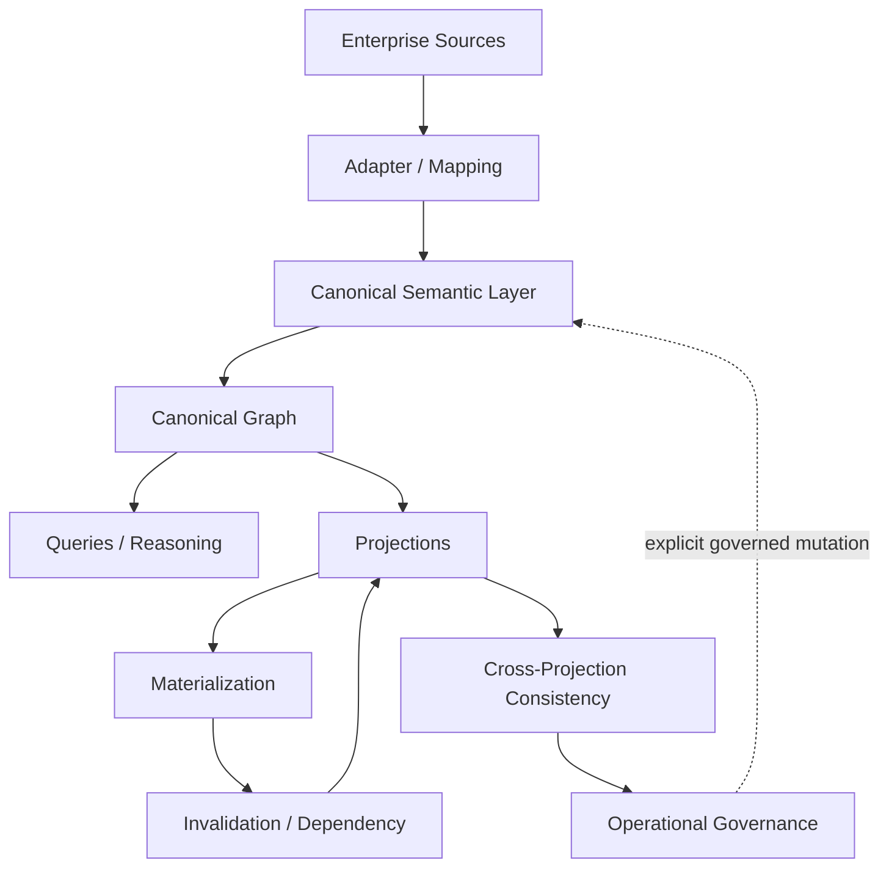
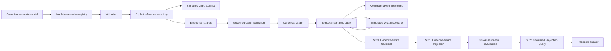

# SCM Ontology Documentation

This directory is the documentation index for SCM Ontology after **M8 COMPLETE**.

## Start here

1. [`../README.md`](../README.md) — project overview and architecture diagrams
2. [`milestones/S310-m8-acceptance-closure.md`](milestones/S310-m8-acceptance-closure.md) — M8 acceptance boundary
3. [`architecture/current-architecture.md`](architecture/current-architecture.md) — current architecture and layer responsibilities
4. [`roadmap-post-m8.md`](roadmap-post-m8.md) — active post-M8 implementation roadmap
5. [`../registry/canonical-registry.v0.2.json`](../registry/canonical-registry.v0.2.json) — machine-readable canonical vocabulary
6. [`reference-canonicalization.md`](reference-canonicalization.md) — first post-M8 implementation boundary for explicit source-to-canonical mappings
7. [`S318-constraint-reasoning.md`](S318-constraint-reasoning.md) — constraint-aware semantic path reasoning
8. [`S319-temporal-semantic-query.md`](S319-temporal-semantic-query.md) — governed temporal semantic query contract
9. [`S320-scenario-overlay.md`](S320-scenario-overlay.md) — immutable what-if scenario overlay contract
10. [`S321-evidence-aware-traversal.md`](S321-evidence-aware-traversal.md) — evidence-aware temporal traversal contract
11. [`S323-evidence-aware-projection.md`](S323-evidence-aware-projection.md) — evidence-aware projection contract
12. [`S324-projection-freshness-invalidation.md`](S324-projection-freshness-invalidation.md) — projection freshness and invalidation runtime contract
13. [`S325-governed-projection-query.md`](S325-governed-projection-query.md) — governed projection query contract
14. [`S326-inventory-position.md`](S326-inventory-position.md) — canonical inventory position business question
15. [`S327-demand-supply-gap.md`](S327-demand-supply-gap.md) — canonical demand/supply gap business question
16. [`S328-supplier-delay-impact.md`](S328-supplier-delay-impact.md) — canonical supplier delay impact business question
17. [`S329-multi-hop-supply-risk.md`](S329-multi-hop-supply-risk.md) — canonical multi-hop supply risk business question
18. [`S330-capacity-constraint.md`](S330-capacity-constraint.md) — canonical capacity constraint business question
19. [`S331-network-disruption-propagation.md`](S331-network-disruption-propagation.md) — canonical network disruption propagation business question
20. [`S332-plan-actual-commitment-reconciliation.md`](S332-plan-actual-commitment-reconciliation.md) — canonical plan/actual/commitment reconciliation business question
21. [`S333-decision-context.md`](S333-decision-context.md) — SCM OS decision context boundary
22. [`S334-decision-proposal.md`](S334-decision-proposal.md) — SCM OS decision proposal contract
23. [`S335-reference-canonicalization.md`](S335-reference-canonicalization.md) — reference source-to-canonical boundary
24. [`S336-reference-scm-os-flow.md`](S336-reference-scm-os-flow.md) — reference end-to-end SCM OS flow
25. [`S337-graph-projection-boundary.md`](S337-graph-projection-boundary.md) — governed graph projection boundary
26. [`S338-graph-query-boundary.md`](S338-graph-query-boundary.md) — governed graph query boundary
27. [`S339-graph-observation-boundary.md`](S339-graph-observation-boundary.md) — graph-to-reasoning observation boundary
28. [`S340-context-assembly-boundary.md`](S340-context-assembly-boundary.md) — decision context assembly boundary
29. [`S341-context-readiness-boundary.md`](S341-context-readiness-boundary.md) — decision context readiness boundary
30. [`S342-reasoning-input-boundary.md`](S342-reasoning-input-boundary.md) — reasoning input boundary
31. [`S343-reasoning-output-boundary.md`](S343-reasoning-output-boundary.md) — reasoning output boundary
32. [`S344-proposal-validation-boundary.md`](S344-proposal-validation-boundary.md) — proposal validation boundary
33. [`S345-decision-authorization-boundary.md`](S345-decision-authorization-boundary.md) — decision authorization boundary
34. [`S346-execution-command-boundary.md`](S346-execution-command-boundary.md) — execution command boundary
35. [`S348-decision-runtime.md`](S348-decision-runtime.md) — SCM Decision Runtime v0 (Phase R1)
36. [`S351-rule-reasoning-provider.md`](S351-rule-reasoning-provider.md) — rule-based reasoning provider (Phase R2)
37. [`S352-llm-reasoning-provider.md`](S352-llm-reasoning-provider.md) — LLM reasoning provider (Phase R2)
38. [`S353-execution-runtime.md`](S353-execution-runtime.md) — SCM Execution Runtime v0 (Phase R3)
39. [`S354-governed-audit.md`](S354-governed-audit.md) — governed decision audit trail & replay (Phase R4)
40. [`S355-command-lifecycle.md`](S355-command-lifecycle.md) — command lifecycle (Phase R4)
41. [`S356-authorization-governance.md`](S356-authorization-governance.md) — authorization policy, approval & override (Phase R4)
42. [`S358-replenishment-application.md`](S358-replenishment-application.md) — replenishment decision application (Phase R5)
43. [`S360-procurement-application.md`](S360-procurement-application.md) — procurement decision application (Phase R5)
44. [`S361-production-application.md`](S361-production-application.md) — production decision application (Phase R5)
45. [`S362-distribution-application.md`](S362-distribution-application.md) — distribution decision application (Phase R5)
46. [`S363-governed-simulation.md`](S363-governed-simulation.md) — governed simulation application (Phase 5)
47. [`S364-optimized-planning.md`](S364-optimized-planning.md) — optimized replenishment plan application (Phase 5)
48. [`S365-optimized-app-planning.md`](S365-optimized-app-planning.md) — optimized procurement/production/distribution plan applications (Phase 5)
49. [`S366-operational-workflow.md`](S366-operational-workflow.md) — operational workflow application (Phase 5)
50. [`P6A-scm-os-cockpit.md`](P6A-scm-os-cockpit.md) — SCM OS Cockpit v0 (Phase 6 P6-A)
51. [`milestones/`](milestones/) — milestone definitions and acceptance reports
52. [`architecture/`](architecture/) — architecture freezes and governance contracts
53. [`archive/`](archive/) — historical documentation no longer part of the active documentation surface
53. [`../AGENTS.md`](../AGENTS.md) — development/agent contract

## Conceptual architecture

## Machine-readable semantic surface

The registry is deliberately separate from persistence. It describes the canonical vocabulary and relationship signatures; it does not prescribe a database schema and does not create or mutate Canonical Truth.

## Governance architecture

The project separates five concerns that are often accidentally collapsed in enterprise data platforms:

| Concern | Meaning |
|---|---|
| **Canonical Truth** | Governed facts and their versions/lifecycle |
| **Evidence / Provenance** | Why a fact or result exists and where it came from |
| **Derived / Projected State** | Calculations, aggregations, views, materializations |
| **Governance Decisions** | Explicit approvals, conflict resolutions, applications |
| **Operational Execution** | Replayable, observable implementation of governed operations |

The separation is deliberate: a system may derive a useful answer without changing what the organization regards as Canonical Truth.

## Post-M8 runtime contracts

- S311 — Governed Canonical Graph Persistence Planning
- S312 — Transport-neutral Graph Store Adapter
- S313 — Injected Neo4j Graph Store Adapter
- S314 — Temporal Relationship Persistence
- S317 — Temporal Semantic Path Traversal
- S318 — Constraint-aware Supply Chain Reasoning
- S319 — Temporal Semantic Supply Chain Query
- S320 — Immutable What-if Scenario Overlay
- S321 — Evidence-aware Traversal
- S322 — Deterministic Projection / Materialization Runtime
- S323 — Evidence-aware Projection
- S324 — Projection Freshness & Invalidation Runtime
- S325 — Governed Projection Query
- S326 — Canonical Inventory Position Business Question
- S327 — Canonical Demand/Supply Gap Business Question
- S328 — Canonical Supplier Delay Impact Business Question
- S329 — Canonical Multi-Hop Supply Risk Business Question
- S330 — Canonical Capacity Constraint Business Question
- S331 — Canonical Network Disruption Propagation Business Question
- S332 — Canonical Plan / Actual / Commitment Reconciliation Business Question
- S333 — SCM OS Decision Context Boundary
- S334 — SCM OS Decision Proposal Contract
- S335 — Reference Source-to-Canonical Boundary
- S336 — Reference End-to-End SCM OS Flow
- S337 — Governed Graph Projection Boundary
- S338 — Governed Graph Query Boundary
- S339 — Graph-to-Reasoning Observation Boundary
- S340 — Decision Context Assembly Boundary
- S341 — Decision Context Readiness Boundary
- S342 — Reasoning Input Boundary
- S343 — Reasoning Output Boundary
- S344 — Proposal Validation Boundary
- S345 — Decision Authorization Boundary
- S346 — Execution Command Boundary
- S348 — SCM Decision Runtime v0 (Phase R1)
- S351 — Rule-Based Reasoning Provider (Phase R2)
- S352 — LLM Reasoning Provider (Phase R2)
- S353 — SCM Execution Runtime v0 (Phase R3)
- S354 — Governed Decision Audit Trail & Replay (Phase R4)
- S355 — Command Lifecycle (Phase R4)
- S356 — Authorization Policy, Approval & Override (Phase R4)
- S358 — Replenishment Decision Application (Phase R5)
- S360 — Procurement Decision Application (Phase R5)
- S361 — Production Decision Application (Phase R5)
- S362 — Distribution Decision Application (Phase R5)
- S363 — Governed Simulation Application (Phase 5)
- S364 — Optimized Replenishment Plan Application (Phase 5)
- S365 — Optimized Procurement/Production/Distribution Plan Applications (Phase 5)
- S366 — Operational Workflow Application (Phase 5)

S321 provides the first explicit evidence requirement at traversal time. S323 carries the same separation into projection state: evidence identifiers are supplied through an external governed mapping and only evidence explicitly consulted by projection code is retained in projection lineage. S324 makes projection lifecycle state observable by comparing the materialized lineage against current graph and projection dependencies. S325 makes the query boundary fail closed unless the requested projection is current and contract-compatible. S326 resolves an inventory position, S327 resolves a demand/supply gap, S328 resolves supplier schedule delay, S329 propagates explicit upstream risk over declared multi-hop dependencies, S330 compares explicit capacity and requirement facts as Phase 4 business-question slices, S331 propagates explicit disruption observations over declared directed dependencies, and S332 reconciles explicit plan, actual, and commitment facts over an exact item/period/unit scope. S333 bundles already-canonical observations into an immutable decision context, and S334..S346 compose the governed cognitive loop (context -> reasoning input -> reasoning output -> proposal validation -> authorization -> immutable execution command). S348 binds that loop into a deterministic, side-effect-free Python API (SCM Decision Runtime v0), reusing the S333..S346 contracts without defining new canonical semantics. S351 implements the S368 provider boundary with a deterministic rule engine, and S352 connects an injected, transport-neutral LLM client to the same boundary without coupling the ontology to a vendor SDK. Both families run through the S348 governed loop. S353 processes an immutable ExecutionCommand through a bounded, injected ExecutionAdapter as a deterministic, side-effect-free dry run, returning an immutable DryRunExecutionResult.
 S354 records a governed decision as a content-addressed audit entry and replays the deterministic governed chain to prove reproducibility. S355 tracks the command lifecycle as an immutable, governed state machine. S356 provides the fail-closed authorization policy, human-approval, and senior-override gates. S354–S356 form Phase R4 (Governance). S358 is the first Phase R5 application: it resolves on-hand inventory to a replenishment decision and, when a reorder is needed, drives it through the governed loop to an authorized execution command and dry run. S360 resolves a demand/supply shortage into a procurement decision and, when a purchase is required, drives it through the governed loop. S361 resolves a production requirement against capacity into a scheduling decision and, when feasible, drives it through the governed loop. S362 resolves a shipment requirement against transportation capacity into a distribution decision and, when feasible, drives it through the governed loop. S358–S362 form the first Phase R5 application set across the physical material flow: replenish -> procure -> produce -> distribute. S363 composes those four applications into a bounded, multi-period, multi-decision simulation, running each step through the same governed loop in a deterministic, side-effect-free run. S364 extends the single-period replenishment decision into an optimized multi-period replenishment plan: it deterministically computes lot-for-lot replenishment quantities that minimize holding cost while avoiding stockouts, records the result as a `Plan`, and runs each period through the governed loop. S365 applies the same multi-period planning/optimization pattern to procurement, production, and distribution, spanning the full physical material flow: replenish -> procure -> produce -> distribute. S366 closes the loop after a decision: it consumes governed decision output, records a content-addressed audit entry (S354), advances each command lifecycle to the dry-run state (S355), and produces an immutable workflow report.

## M8 documentation set

- S294 — Conflict Resolution Governance
- S300 — Canonical Fact Lifecycle & Versioning
- S301 — Canonical Fact Application & Version Transition
- S302 — Temporal & Historical Query
- S303 — Canonical Graph Read & Projection Boundary
- S304 — Projection Freshness & Lineage
- S305 — Governed Projection Query
- S306 — Governed Projection Materialization
- S307 — Projection Invalidation & Dependency Propagation
- S308 — Cross-Projection Consistency & Rebuild Boundary
- S309 — Operational Readiness & Governance
- S310 — M8 Acceptance & Closure

## Reading the contracts

The word **MUST** is normative. A future implementation that violates a MUST is non-conformant even if it is convenient, fast, or technically successful.

M8 is intentionally implementation-neutral. Database choice, graph engine, scheduler, queue, authorization product, API style, and deployment topology are implementation decisions that must conform to the semantic contracts.

## Documentation maintenance rule

When a contract changes, update:

1. the normative contract;
2. its regression tests;
3. the relevant architecture/index document;
4. the README if the conceptual architecture changes.

Historical documents are retained only when they provide useful provenance. Superseded design drafts should be moved out of the active documentation surface rather than presented as current guidance.
