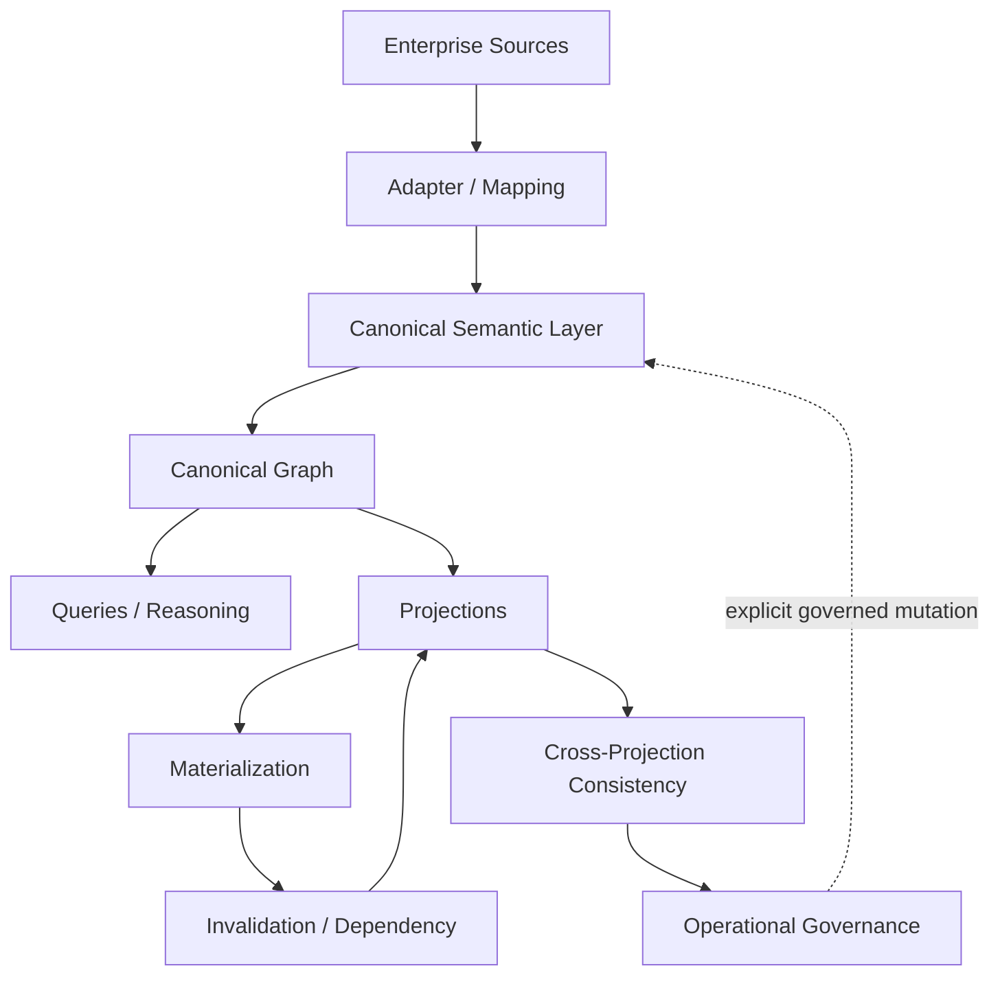
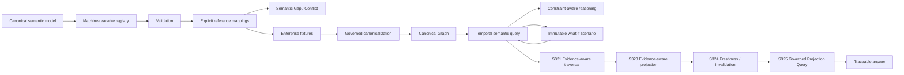

# SCM Ontology Documentation

This directory is the documentation index for SCM Ontology after **M8 COMPLETE**.

## Start here

1. [`../README.md`](../README.md) — project overview and architecture diagrams
2. [`milestones/S310-m8-acceptance-closure.md`](milestones/S310-m8-acceptance-closure.md) — M8 acceptance boundary
3. [`architecture/current-architecture.md`](architecture/current-architecture.md) — current architecture and layer responsibilities
4. [`roadmap-post-m8.md`](roadmap-post-m8.md) — active post-M8 implementation roadmap
5. [`../registry/canonical-registry.v0.2.json`](../registry/canonical-registry.v0.2.json) — machine-readable canonical vocabulary
6. [`reference-canonicalization.md`](reference-canonicalization.md) — first post-M8 implementation boundary for explicit source-to-canonical mappings
7. [`S318-constraint-reasoning.md`](S318-constraint-reasoning.md) — constraint-aware semantic path reasoning
8. [`S319-temporal-semantic-query.md`](S319-temporal-semantic-query.md) — governed temporal semantic query contract
9. [`S320-scenario-overlay.md`](S320-scenario-overlay.md) — immutable what-if scenario overlay contract
10. [`S321-evidence-aware-traversal.md`](S321-evidence-aware-traversal.md) — evidence-aware temporal traversal contract
11. [`S323-evidence-aware-projection.md`](S323-evidence-aware-projection.md) — evidence-aware projection contract
12. [`S324-projection-freshness-invalidation.md`](S324-projection-freshness-invalidation.md) — projection freshness and invalidation runtime contract
13. [`S325-governed-projection-query.md`](S325-governed-projection-query.md) — governed projection query contract
14. [`S326-inventory-position.md`](S326-inventory-position.md) — canonical inventory position business question
15. [`S327-demand-supply-gap.md`](S327-demand-supply-gap.md) — canonical demand/supply gap business question
16. [`S328-supplier-delay-impact.md`](S328-supplier-delay-impact.md) — canonical supplier delay impact business question
17. [`S329-multi-hop-supply-risk.md`](S329-multi-hop-supply-risk.md) — canonical multi-hop supply risk business question
18. [`S330-capacity-constraint.md`](S330-capacity-constraint.md) — canonical capacity constraint business question
19. [`S331-network-disruption-propagation.md`](S331-network-disruption-propagation.md) — canonical network disruption propagation business question
20. [`milestones/`](milestones/) — milestone definitions and acceptance reports
21. [`architecture/`](architecture/) — architecture freezes and governance contracts
22. [`archive/`](archive/) — historical documentation no longer part of the active documentation surface
23. [`../AGENTS.md`](../AGENTS.md) — development/agent contract

## Conceptual architecture

## Machine-readable semantic surface

The registry is deliberately separate from persistence. It describes the canonical vocabulary and relationship signatures; it does not prescribe a database schema and does not create or mutate Canonical Truth.

## Governance architecture

The project separates five concerns that are often accidentally collapsed in enterprise data platforms:

| Concern | Meaning |
|---|---|
| **Canonical Truth** | Governed facts and their versions/lifecycle |
| **Evidence / Provenance** | Why a fact or result exists and where it came from |
| **Derived / Projected State** | Calculations, aggregations, views, materializations |
| **Governance Decisions** | Explicit approvals, conflict resolutions, applications |
| **Operational Execution** | Replayable, observable implementation of governed operations |

The separation is deliberate: a system may derive a useful answer without changing what the organization regards as Canonical Truth.

## Post-M8 runtime contracts

- S311 — Governed Canonical Graph Persistence Planning
- S312 — Transport-neutral Graph Store Adapter
- S313 — Injected Neo4j Graph Store Adapter
- S314 — Temporal Relationship Persistence
- S317 — Temporal Semantic Path Traversal
- S318 — Constraint-aware Supply Chain Reasoning
- S319 — Temporal Semantic Supply Chain Query
- S320 — Immutable What-if Scenario Overlay
- S321 — Evidence-aware Traversal
- S322 — Deterministic Projection / Materialization Runtime
- S323 — Evidence-aware Projection
- S324 — Projection Freshness & Invalidation Runtime
- S325 — Governed Projection Query
- S326 — Canonical Inventory Position Business Question
- S327 — Canonical Demand/Supply Gap Business Question
- S328 — Canonical Supplier Delay Impact Business Question
- S329 — Canonical Multi-Hop Supply Risk Business Question
- S330 — Canonical Capacity Constraint Business Question
- S331 — Canonical Network Disruption Propagation Business Question

S321 provides the first explicit evidence requirement at traversal time. S323 carries the same separation into projection state: evidence identifiers are supplied through an external governed mapping and only evidence explicitly consulted by projection code is retained in projection lineage. S324 makes projection lifecycle state observable by comparing the materialized lineage against current graph and projection dependencies. S325 makes the query boundary fail closed unless the requested projection is current and contract-compatible. S326 resolves an inventory position, S327 resolves a demand/supply gap, S328 resolves supplier schedule delay, S329 propagates explicit upstream risk over declared multi-hop dependencies, S330 compares explicit capacity and requirement facts as Phase 4 business-question slices, and S331 propagates explicit disruption observations over declared directed dependencies.

## M8 documentation set

- S294 — Conflict Resolution Governance
- S300 — Canonical Fact Lifecycle & Versioning
- S301 — Canonical Fact Application & Version Transition
- S302 — Temporal & Historical Query
- S303 — Canonical Graph Read & Projection Boundary
- S304 — Projection Freshness & Lineage
- S305 — Governed Projection Query
- S306 — Governed Projection Materialization
- S307 — Projection Invalidation & Dependency Propagation
- S308 — Cross-Projection Consistency & Rebuild Boundary
- S309 — Operational Readiness & Governance
- S310 — M8 Acceptance & Closure

## Reading the contracts

The word **MUST** is normative. A future implementation that violates a MUST is non-conformant even if it is convenient, fast, or technically successful.

M8 is intentionally implementation-neutral. Database choice, graph engine, scheduler, queue, authorization product, API style, and deployment topology are implementation decisions that must conform to the semantic contracts.

## Documentation maintenance rule

When a contract changes, update:

1. the normative contract;
2. its regression tests;
3. the relevant architecture/index document;
4. the README if the conceptual architecture changes.

Historical documents are retained only when they provide useful provenance. Superseded design drafts should be moved out of the active documentation surface rather than presented as current guidance.
