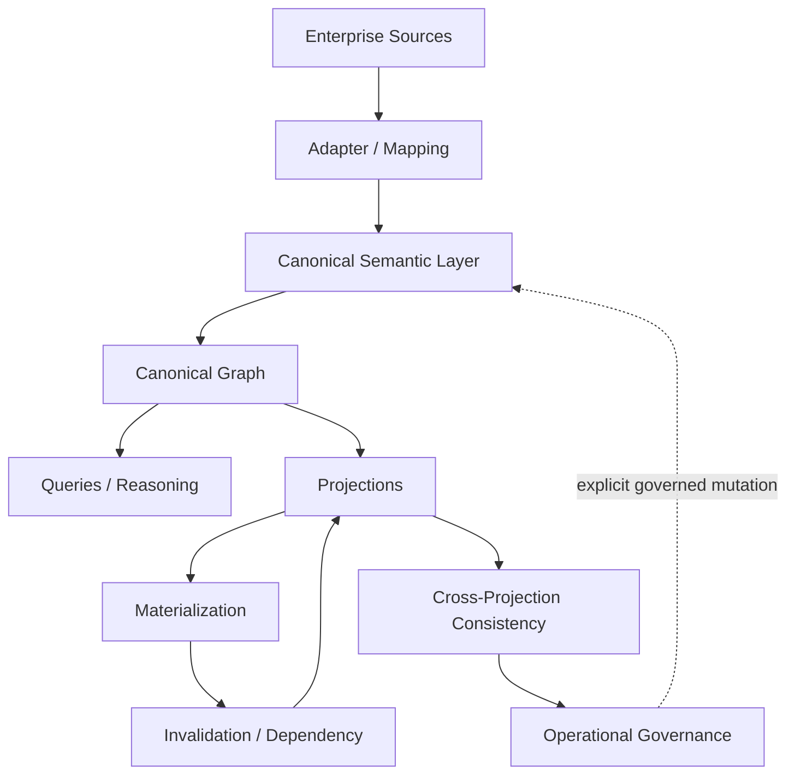

# SCM Ontology Documentation

This directory is the documentation index for SCM Ontology after **M8 COMPLETE**.

## Start here

1. [`../README.md`](../README.md) — project overview and architecture diagrams
2. [`milestones/S310-m8-acceptance-closure.md`](milestones/S310-m8-acceptance-closure.md) — M8 acceptance boundary
3. [`architecture/current-architecture.md`](architecture/current-architecture.md) — current architecture and layer responsibilities
4. [`milestones/`](milestones/) — milestone definitions and acceptance reports
5. [`architecture/`](architecture/) — architecture freezes and governance contracts
6. [`roadmap-post-m8.md`](roadmap-post-m8.md) — post-M8 implementation roadmap
7. [`archive/`](archive/) — historical documentation no longer part of the active documentation surface
8. [`../AGENTS.md`](../AGENTS.md) — development/agent contract

## Conceptual architecture

## Governance architecture

The project separates five concerns that are often accidentally collapsed in enterprise data platforms:

| Concern | Meaning |
|---|---|
| **Canonical Truth** | Governed facts and their versions/lifecycle |
| **Evidence / Provenance** | Why a fact or result exists and where it came from |
| **Derived / Projected State** | Calculations, aggregations, views, materializations |
| **Governance Decisions** | Explicit approvals, conflict resolutions, applications |
| **Operational Execution** | Replayable, observable implementation of governed operations |

The separation is deliberate: a system may derive a useful answer without changing what the organization regards as Canonical Truth.

## M8 documentation set

- S294 — Conflict Resolution Governance
- S300 — Canonical Fact Lifecycle & Versioning
- S301 — Canonical Fact Application & Version Transition
- S302 — Temporal & Historical Query
- S303 — Canonical Graph Read & Projection Boundary
- S304 — Projection Freshness & Lineage
- S305 — Governed Projection Query
- S306 — Governed Projection Materialization
- S307 — Projection Invalidation & Dependency Propagation
- S308 — Cross-Projection Consistency & Rebuild Boundary
- S309 — Operational Readiness & Governance
- S310 — M8 Acceptance & Closure

## Reading the contracts

The word **MUST** is normative. A future implementation that violates a MUST is non-conformant even if it is convenient, fast, or technically successful.

M8 is intentionally implementation-neutral. Database choice, graph engine, scheduler, queue, authorization product, API style, and deployment topology are implementation decisions that must conform to the semantic contracts.

## Documentation maintenance rule

When a contract changes, update:

1. the normative contract;
2. its regression tests;
3. the relevant architecture/index document;
4. the README if the conceptual architecture changes.

Historical documents are retained only when they provide useful provenance. Superseded design drafts should be moved out of the active documentation surface rather than presented as current guidance.
