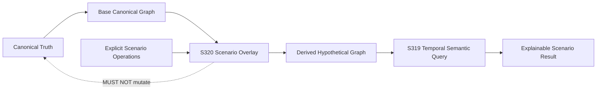

# S320 — Immutable What-if Scenario Overlay

## Purpose

S320 defines the first scenario boundary for SCM Ontology. A scenario expresses an explicit hypothetical change to canonical relationships and evaluates a query against the resulting **derived graph view**.

The scenario is a reasoning input, not a Canonical Truth mutation.

## Contract

A conforming implementation MUST:

1. identify a scenario with a stable `scenario_id`;
2. represent every hypothetical change as an explicit `add`, `remove`, or `replace` operation;
3. reject duplicate operations against the same relationship identity;
4. reject `add` when the relationship already exists;
5. reject `remove` or `replace` when the relationship does not exist;
6. leave the supplied `CanonicalGraph` unchanged;
7. evaluate the derived graph using the existing temporal semantic query contract;
8. expose both the base graph digest and scenario digest;
9. return deterministic, JSON-safe results;
10. preserve the distinction between hypothetical scenario state and Canonical Truth.

## Deliberate non-goals

S320 does **not** perform:

- identity resolution;
- fuzzy matching;
- semantic inference;
- optimization;
- allocation;
- feasibility optimization;
- operational execution;
- authorization to mutate Canonical Truth.

Those concerns remain separate contracts.

## Scenario operations

```text
ScenarioOperation
  operation: add | remove | replace
  relationship: CanonicalRelationship
```

A relationship identity is the stable `relationship_id` from the canonical relationship instance. Scenario operations therefore remain explicit and auditable.

## Provenance

A scenario result MUST expose:

- `base_graph_digest`: digest of the Canonical Truth graph supplied to the scenario;
- `scenario_digest`: deterministic digest of the scenario definition;
- the existing temporal query result and its graph digest for the derived graph.

The scenario digest identifies the hypothetical input. The base graph digest identifies the canonical starting point. Neither digest implies that the scenario was approved or applied.

## Architectural position



## Example

Given:

```text
A --ships_to--> B
```

A scenario may explicitly add:

```text
B --ships_to--> C
```

A temporal query from `A` to `C` can then resolve the hypothetical path:

```text
A -> B -> C
```

The original canonical graph remains:

```text
A --ships_to--> B
```

This makes S320 suitable as a semantic boundary for future supply-chain what-if analysis, simulation, and planning without prematurely embedding optimization or execution into the ontology runtime.
