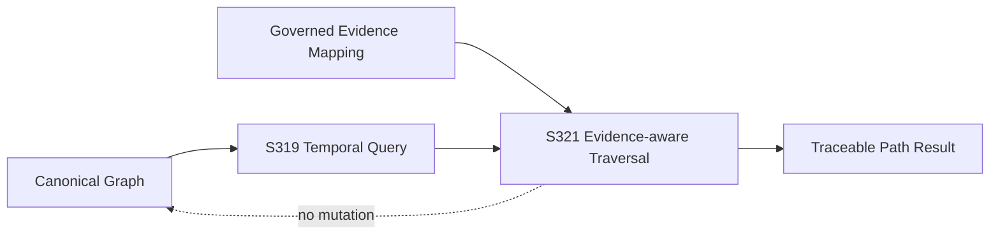

# S321 — Evidence-aware Traversal

## Purpose

S321 defines a read-only traversal boundary that combines the S319 temporal semantic query with explicit supporting evidence identifiers.

The evidence mapping is external to the Canonical Graph. S321 therefore improves explainability without turning provenance metadata into Canonical Truth.

## Contract

A conforming implementation MUST:

1. reuse the S319 temporal semantic query semantics;
2. accept an explicit mapping from canonical `relationship_id` to evidence identifier(s);
3. preserve the relationship identity, predicate, endpoints, and temporal qualifiers of every traversed step;
4. expose the evidence identifiers associated with every traversed step;
5. when evidence is required, fail closed if any traversed relationship lacks evidence;
6. leave the supplied Canonical Graph unchanged;
7. preserve the S319 graph digest as query-level provenance;
8. return deterministic, JSON-safe results;
9. keep evidence resolution separate from identity resolution and semantic inference.

## Evidence model

```text
Canonical Relationship
       |
       v
relationship_id ──────> governed evidence mapping ──────> evidence_id(s)
```

S321 consumes the mapping; it does not decide whether an evidence record is authoritative, resolve conflicting evidence, or apply a fact to Canonical Truth.

## Required vs optional evidence

`require_evidence=True` is the governed default. A path containing any relationship without an evidence identifier raises `EvidenceMissing` rather than returning an apparently explainable result.

An implementation may explicitly set `require_evidence=False` for exploratory use. In that mode, missing evidence is represented as an empty evidence list and is not silently fabricated.

## Provenance

The response exposes:

- `contract_version`;
- query inputs;
- `graph_digest` inherited from S319;
- path node IDs;
- relationship identity and semantic qualifiers;
- evidence IDs for each relationship step.

No evidence ID implies that a scenario, query, or traversal was approved. Evidence remains provenance, not authorization.

## Architectural position



## Deliberate non-goals

S321 does **not** perform:

- evidence discovery or source polling;
- evidence authority adjudication;
- identity resolution;
- fuzzy matching;
- semantic inference;
- optimization;
- allocation;
- operational execution;
- mutation or authorization of Canonical Truth.
