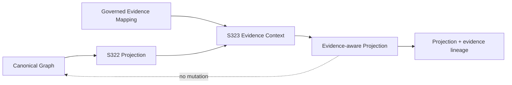

# S323 — Evidence-aware Projection

## Purpose

S323 extends the deterministic S322 projection/materialization boundary with explicit evidence access. A projection may derive an answer from Canonical Graph relationships while preserving which externally governed evidence identifiers were consulted.

The evidence mapping remains outside Canonical Truth. Projection success is not evidence of truth, authority, identity, approval, or authorization.

## Contract

A conforming implementation MUST:

1. reuse the S322 projection lineage semantics and protocol version;
2. accept evidence through an explicit external mapping from canonical `relationship_id` to evidence identifier(s);
3. expose evidence only when projection code explicitly requests it through the evidence context;
4. preserve the relationship IDs whose evidence was consulted;
5. normalize evidence identifiers deterministically;
6. when evidence is required, fail closed if requested relationship evidence is missing;
7. allow exploratory omission only through an explicit `require_evidence=False` setting;
8. preserve the S322 source digest, projection identity, and projection version;
9. leave the supplied Canonical Graph unchanged;
10. return deterministic, UTF-8-safe, JSON-safe results;
11. keep evidence resolution separate from identity resolution, semantic inference, and Canonical Truth mutation.

## Evidence access model

```text
Canonical Graph
      |
      v
Projection definition ──> Evidence context ──> governed evidence mapping
      |                         |
      +-------------------------+----> derived projection value
                                  |
                                  +----> evidence-by-relationship lineage
```

The projection runtime records only relationship evidence that the projection explicitly requests. This prevents unrelated evidence from being attached merely because it happens to exist in the external mapping.

## Required vs optional evidence

`require_evidence=True` is the governed default. If a projection asks for evidence for a relationship and none is supplied, `ProjectionEvidenceMissing` is raised and no apparently explainable result is returned.

`require_evidence=False` is an explicit exploratory mode. Missing evidence is represented as an empty tuple/list; evidence is never fabricated.

## Lineage

The result preserves:

- `contract_version`;
- `status`;
- `projection_id`;
- `projection_version`;
- the S322 `source_digest`;
- the derived projection value;
- `evidence_by_relationship_id`;
- matching evidence lineage under `lineage`.

The evidence mapping is derived metadata. It does not become part of Canonical Truth and does not authorize any downstream action.

## Architectural position



## Deliberate non-goals

S323 does **not** perform:

- evidence discovery or source polling;
- evidence authority adjudication;
- identity resolution;
- fuzzy matching;
- semantic inference;
- conflict resolution;
- projection freshness or invalidation;
- governed projection querying;
- operational execution;
- mutation or authorization of Canonical Truth.
