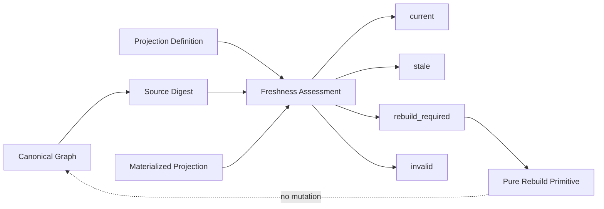

# S324 — Projection Freshness & Invalidation Runtime

## Purpose

S324 turns the M8 projection lifecycle states into a small deterministic runtime boundary. It evaluates whether a materialized projection still matches its Canonical Graph dependency and projection definition, and it represents explicit invalidation without mutating Canonical Truth.

S324 is deliberately read-only. It does not persist cache entries, schedule refreshes, authorize rebuilds, or propagate mutations into Canonical Facts.

## Contract

A conforming implementation MUST:

1. reuse the S322/S323 projection protocol and lineage semantics;
2. derive dependency freshness from the Canonical Graph source digest;
3. treat a changed source digest as `stale`;
4. treat a projection identity or version mismatch as `rebuild_required`;
5. treat a non-materialized result as `invalid`;
6. expose explicit invalidation as an observable `invalid` lifecycle state;
7. preserve the original projection source digest and projection identity in lifecycle results;
8. provide a deterministic, UTF-8-safe, JSON-safe lifecycle representation;
9. leave the supplied Canonical Graph and ProjectionResult unchanged;
10. keep persistence, scheduling, authorization, dependency propagation, and governed recovery outside this runtime boundary.

## Lifecycle model

```text
                    dependency change
current --------------------------------> stale
  |                                       |
  |                                       +--> rebuild_required
  |                                       |
  |                                       +--> invalid
  |
  +--------------------------------------> current
             dependencies match
```

The implementation also recognizes the M8 states `failed` and `conflicted` as valid lifecycle vocabulary, while S324 does not manufacture those outcomes itself. They remain available to higher-level governed workflows.

## Freshness evaluation

`assess_projection_freshness(graph, definition, result)` compares:

- protocol version;
- projection identity;
- projection version;
- materialization status;
- current Canonical Graph SHA-256 digest.

The first semantic mismatch determines the lifecycle state. A matching result is `current`.

## Invalidation

`invalidate_projection(result, reason)` is an explicit, pure representation of invalidation. It does not alter the supplied `ProjectionResult` and does not touch Canonical Truth.

## Rebuild boundary

`rebuild_projection(graph, definition)` is only a deterministic recomputation primitive. Persistence of the rebuilt result, scheduling, authorization, retry policy, dependency propagation, and operational recovery are intentionally outside S324.

## Architectural position



## Deliberate non-goals

S324 does **not** perform:

- projection persistence;
- cache eviction;
- scheduling or refresh orchestration;
- automatic invalidation propagation;
- authorization;
- dependency graph mutation;
- Canonical Truth mutation;
- cross-projection consistency evaluation;
- operational execution.
