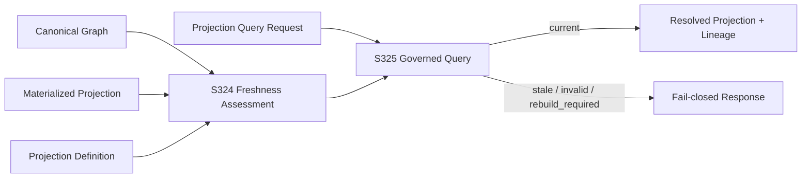

# S325 — Governed Projection Query

## Purpose

S325 establishes the read-only query boundary for derived projection state. It converts the S324 lifecycle assessment into a governed answer surface: a projection is exposed only when the requested projection identity/version and protocol are compatible and the materialized result is `current`.

The boundary is deliberately fail-closed. A stale, invalid, or rebuild-required projection is not silently returned as a valid answer.

## Contract

A conforming implementation MUST:

1. accept an explicit projection identity and version;
2. validate the query contract version before resolving the projection;
3. validate the requested identity and version against the supplied projection definition;
4. reuse S324 freshness assessment rather than implementing a second freshness algorithm;
5. expose the projection payload only when lifecycle state is `current`;
6. preserve lifecycle state and reason when the query is not resolved;
7. return deterministic, JSON-safe response mappings;
8. remain read-only with respect to Canonical Truth;
9. not refresh, rebuild, persist, schedule, authorize, or mutate a projection as a side effect of querying;
10. preserve projection lineage in a resolved response.

## Query states

| Query status | Meaning |
|---|---|
| `resolved` | Requested projection is contract-compatible and `current`. |
| `contract_version_mismatch` | Query protocol version is unsupported. |
| `projection_mismatch` | Requested identity or version does not match the supplied definition. |
| `stale` | Materialized projection no longer matches the current Canonical Graph digest. |
| `rebuild_required` | Projection contract identity/version is no longer compatible with the materialized result. |
| `invalid` | Materialized result is not queryable, for example because it is not materialized. |

Non-resolved states MUST NOT include the projection payload.

## Runtime boundary

`execute_projection_query(request, graph, definition, result)` performs only query-time validation and S324 lifecycle assessment. It does not call the projector and therefore does not implicitly rebuild or refresh derived state.

The resolved response contains:

- protocol version;
- query status;
- the existing projection mapping, including value and lineage;
- the `current` lifecycle assessment.

A rejected response contains:

- protocol version;
- explicit query status;
- lifecycle state and reason where applicable;
- an error describing the rejected condition;
- no projection payload.

## Architectural position



## Mutation boundary

```text
Projection Query
      │
      ▼
Validated / Observable Response
      │
      X  no refresh, rebuild, persistence, authorization, or Canonical mutation
```

S325 therefore completes the reference implementation chain from projection materialization and lifecycle assessment to a safe read surface without collapsing derived state into Canonical Truth.

## Deliberate non-goals

S325 does **not** perform:

- projection materialization;
- projection refresh or rebuild;
- persistence or cache management;
- authorization policy evaluation;
- dependency propagation;
- Canonical Truth mutation;
- cross-projection consistency evaluation;
- operational execution.
