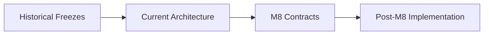

# Architecture Documentation

## Current

- [`current-architecture.md`](./current-architecture.md) — post-M8 architecture and layer boundaries

## Historical freezes

- [`M4-architecture-freeze.md`](./M4-architecture-freeze.md) — M4 semantic/runtime freeze
- [`v0.2-release-candidate.md`](./v0.2-release-candidate.md) — v0.2 RC historical snapshot
- [`extension-governance.md`](./extension-governance.md) — governed extension lifecycle

## Reading order

Historical documents explain how the architecture evolved. The current architecture and normative M8 contracts define what new implementations must satisfy.
