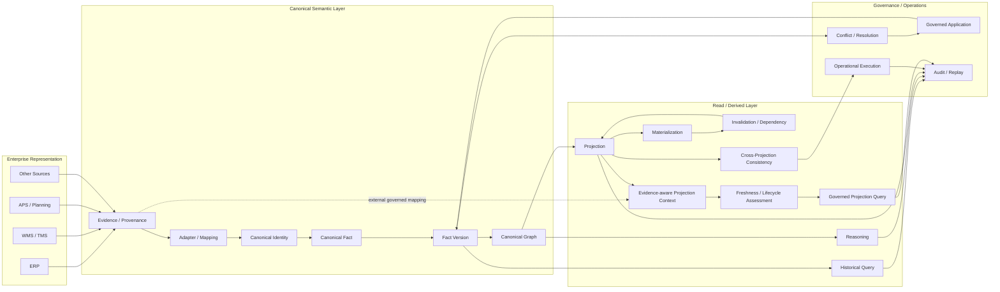
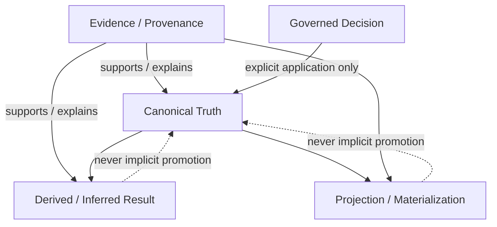
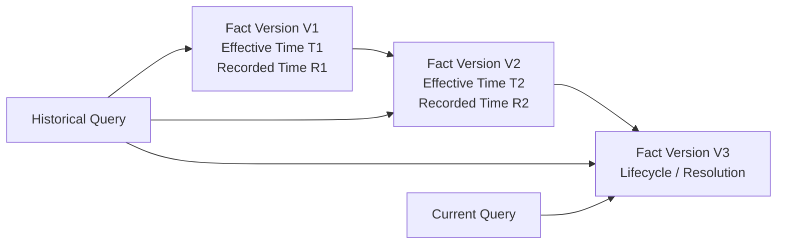
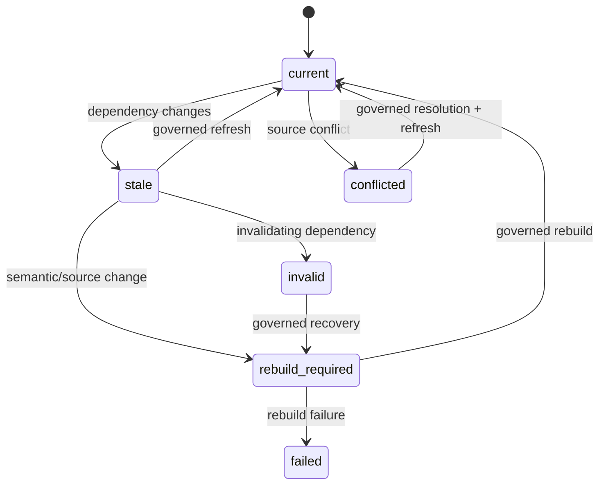

# Current Architecture — Post-M8

## Status

**Current baseline: M8 COMPLETE**

This document supersedes older architecture snapshots as the primary explanation of the current conceptual architecture. Historical architecture freezes remain valuable as historical records and are not rewritten.

## 1. End-to-end architecture



S323 makes the evidence relationship explicit at the projection boundary: projection code can request evidence for a canonical relationship through a dedicated context, while the evidence mapping remains external to Canonical Truth. S324 adds a pure lifecycle assessment boundary that compares projection lineage with current graph and definition dependencies. S325 adds the governed query boundary that exposes only current, contract-compatible projection state.

## 2. Layer responsibilities

### Enterprise Representation

Source-specific representations. Their identifiers, codes, statuses, and semantics are evidence-bearing inputs, not Canonical Truth by default.

### Adapter / Mapping Boundary

Translates source representations into governed mapping results. It preserves ambiguity, Semantic Gap, provenance, and source identity. Mapping success alone never creates Canonical Truth.

### Canonical Semantic Layer

Contains Canonical Identity, Canonical Facts, Fact Versions, lifecycle state, and the Canonical Graph. This is the governed semantic core.

### Read / Derived Layer

Historical queries, reasoning, projections, materializations, invalidation, and consistency evaluation consume Canonical state. S323 evidence-aware projections may also consume an explicit external evidence mapping through a read-only context. S324 evaluates freshness and represents invalidation without mutating the graph. S325 exposes a materialized projection only when the request and lifecycle are current and compatible. These surfaces are read-only with respect to Canonical Truth unless an explicit governed application step is invoked outside their boundary.

### Governance / Operations

Conflict resolution, governed application, operational execution, audit, and replay provide explicit control over state-changing actions and preserve history.

## 3. Truth classes



The most important architectural rule is the dotted boundary: **derived or projected information does not become Canonical Truth merely because it looks plausible, matches a source, or is computationally successful.** Evidence attached to a projection is lineage/provenance, not a promotion path into Canonical Truth.

## 4. Temporal model



Historical reconstruction uses the applicable Fact Version and lifecycle history. It must not silently substitute the current Canonical state for a historical question.

## 5. Projection lifecycle



S324 implements deterministic assessment of the `current`, `stale`, `rebuild_required`, and `invalid` states. `failed` and `conflicted` remain higher-level workflow outcomes and are not fabricated by the runtime. S325 consumes those lifecycle outcomes and fails closed for every non-current state.

## 6. Mutation boundary

```text
Read / Query / Reasoning / Projection / Materialization / Lifecycle Assessment / Governed Projection Query
                         │
                         ▼
                  Observable Result
                         │
                         X  no implicit Canonical mutation

Governed Application ───────────────► Canonical Fact Version
                                      │
                                      └─ append-only lineage
```

## 7. Implementation guidance

M8 does not mandate a specific implementation stack. A conforming implementation may use a relational database, property graph, RDF store, document store, event log, or a combination.

The implementation is conformant only if it can preserve the normative properties of identity, provenance, temporal semantics, versioning, lifecycle, explicit outcomes, replayability, scope isolation, and the Canonical mutation boundary.
