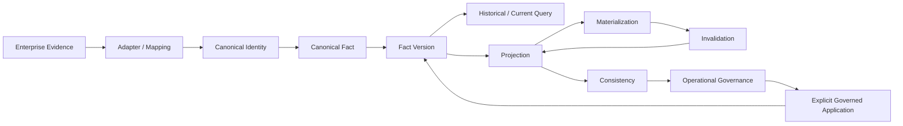

# M8 Acceptance Report — Canonicalization, Projection & Operational Governance

## Status

**M8 COMPLETE**

## Scope

M8 completes the governed lifecycle connecting enterprise evidence to Canonical Truth and then to historical queries, projections, materialization, invalidation, cross-projection consistency, and operational execution.

## Acceptance matrix

| Area | Contract | Result |
|---|---|---|
| Conflict / Resolution | S294 | COMPLETE |
| Canonical Fact lifecycle | S300 | COMPLETE |
| Fact application / version transition | S301 | COMPLETE |
| Temporal / historical query | S302 | COMPLETE |
| Graph read / projection boundary | S303 | COMPLETE |
| Projection freshness / lineage | S304 | COMPLETE |
| Governed projection query | S305 | COMPLETE |
| Projection materialization | S306 | COMPLETE |
| Invalidation / dependency propagation | S307 | COMPLETE |
| Cross-projection consistency / rebuild | S308 | COMPLETE |
| Operational readiness / governance | S309 | COMPLETE |
| End-to-end acceptance / closure | S310 | COMPLETE |

## End-to-end architecture

## Release-blocking invariants

1. Canonical entities, attributes, predicates, or facts are not created implicitly.
2. Mapping success or identity similarity does not establish Canonical Truth.
3. Source identity and provenance remain attached.
4. Fact Versions and lifecycle history are append-only and reconstructable.
5. Historical queries do not silently return current Canonical Truth.
6. Conflict and Resolution Records remain observable and replayable.
7. Projections and materializations remain distinguishable from Canonical Truth.
8. Stale, invalid, rebuild-required, partial, failed, conflicted, unresolved, unsupported, and unknown outcomes remain observable where applicable.
9. Cross-projection discrepancies do not by themselves determine Canonical Truth.
10. Read, projection, invalidation, consistency, rebuild, replay, and recovery operations do not bypass the explicit Canonical mutation boundary.
11. Scope never expands implicitly.
12. Future implementations must preserve the contracts through explicit versioned governance changes.

## Evidence

M8 is protected by the repository's executable contract tests and the cumulative regression suite. The acceptance strategy deliberately tests negative cases: a future implementation that silently mutates Canonical Truth, discards provenance, rewrites history, hides uncertainty, or weakens scope boundaries must fail validation.

## What M8 closes

M8 closes the **semantic and operational contract-definition phase**. It provides a stable target for implementation.

## What M8 does not claim

M8 does not claim that all production connectors, persistence engines, distributed transaction mechanisms, schedulers, authorization products, ingestion pipelines, or high-scale runtime components are complete. Those are implementation work against the M8 contract.

## Post-M8 direction

The next phase should focus on reference implementation and business value:

1. machine-readable canonical registry / ontology;
2. realistic multi-source canonicalization fixtures;
3. graph persistence and query execution;
4. governed identity resolution;
5. SCM business-question applications;
6. integration with planning / simulation / SCM OS;
7. performance, observability, and production operations.
