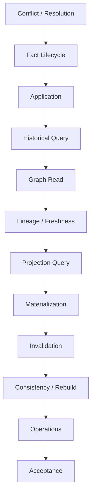

# M8 Slice Index

M8 is complete. This index provides a compact map from contract to architectural role.

| Slice | Architectural role |
|---|---|
| S294 | Conflict and Resolution governance |
| S300 | Canonical Fact lifecycle / versioning |
| S301 | Explicit Fact application boundary |
| S302 | Historical and temporal reconstruction |
| S303 | Canonical Graph read / projection boundary |
| S304 | Projection freshness / lineage |
| S305 | Governed projection querying |
| S306 | Projection materialization |
| S307 | Dependency invalidation / impact propagation |
| S308 | Cross-projection consistency / rebuild |
| S309 | Operational readiness / governance |
| S310 | End-to-end M8 acceptance / closure |

The contracts are cumulative. A later slice does not supersede a safety invariant from an earlier slice; it composes with it.
