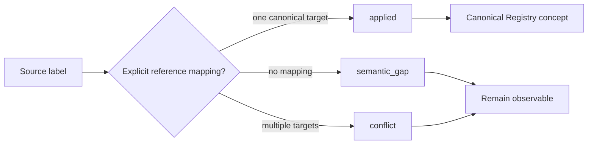

# Reference Canonicalization

## Purpose

Reference canonicalization is the first post-M8 implementation boundary between external labels and the machine-readable Canonical Registry.

It answers a deliberately narrow question:

> **Has an explicit, governed mapping already established which Canonical Concept a source label refers to?**

It does **not** answer whether two real-world records are the same entity, whether a new canonical concept should exist, or whether Canonical Truth should be mutated.

## Flow

## Boundary

- Mappings MUST target an existing Canonical Concept.
- Unmapped labels remain `semantic_gap`.
- Multiple explicit targets remain `conflict`; the implementation does not choose one.
- Mapping does not establish Canonical Identity.
- Mapping does not create or mutate Canonical Facts.
- Mapping does not perform probabilistic matching or semantic inference.
- Results are deterministic for a fixed mapping set and registry version.

## Why this is the correct first implementation

The M8 contracts deliberately separated semantic interpretation, identity resolution, governed application, and graph projection. The machine-readable registry now gives us a stable vocabulary boundary. Reference canonicalization can therefore be implemented without prematurely introducing storage, graph technology, probabilistic identity matching, or autonomous mutation.

The next implementation layers can consume these explicit results while preserving `semantic_gap` and `conflict` as first-class outcomes.
