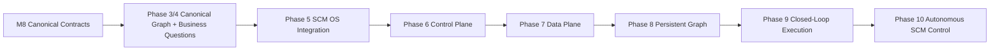

# Post-M8 Implementation Roadmap

M8 completes the semantic and operational contract-definition phase. Phase 3/4 established the Canonical Graph runtime and SCM business-question vertical slices. Phase 5 established the first SCM OS integration layer: governed applications, multi-period simulation, deterministic planning/optimization, and operational workflow.

The roadmap now changes character. Up to Phase 5, the primary goal was to **build and validate contracts and capabilities**. From Phase 6 onward, the goal is to **integrate those capabilities into an SCM OS reference platform and then close the real-world control loop**.



## Current status

**Phase 5 — Complete through S366.**

S348–S356 established the deterministic governed decision/runtime foundation. S358–S362 established applications across the physical material flow: replenish -> procure -> produce -> distribute. S363 established governed multi-period simulation. S364 established deterministic replenishment planning/optimization. S365 extended planning/optimization to procurement, production, and distribution. S366 established the operational workflow/reporting slice by composing governed audit and command lifecycle behavior.

The next milestone is therefore **Phase 6: SCM OS Control Plane**.

---

# Phase 6 — SCM OS Control Plane

## Objective

Turn the existing capabilities into something that behaves like **one SCM OS**, rather than a collection of contracts, runtimes, and application modules.

The Control Plane is the operator-facing coordination layer over Canonical State, Business Questions, Decisions, Simulation, Optimization, Execution, and Governance.

```text
Canonical Graph
      ↓
SCM State / Exceptions
      ↓
Decision Runtime
      ↓
Applications
      ↓
Simulation / Optimization
      ↓
Operational Workflow
      ↓
Audit / Governance
```

### Phase 6 milestones

- [ ] **P6-A — SCM OS Cockpit v0**: a minimal web control plane exposing state, exceptions, decisions, simulation, execution, and governance;
- [ ] **P6-B — Decision Inbox**: inspect proposal, rationale, evidence, provenance, authorization status, and command state without recomputing the decision;
- [ ] **P6-C — Simulation / Optimization Workspace**: launch and inspect deterministic scenarios and plans from the same control plane;
- [ ] **P6-D — Execution Workflow Workspace**: inspect command lifecycle, dry-run results, approval gates, and audit trail;
- [ ] **P6-E — Control Plane E2E**: one deterministic user workflow traverses State → Decision → Simulation/Plan → Authorization → Workflow → Audit;
- [ ] **P6-F — Phase 6 acceptance**: the major existing runtime capabilities are discoverable and operable from one coherent SCM OS surface.

### Design rule

The Control Plane must **compose existing contracts**. It must not become a second source of SCM semantics and must not duplicate decision logic already implemented in the runtime/application layers.

---

# Phase 7 — SCM OS Real Data Plane

## Objective

Move from reference/in-memory fixtures toward heterogeneous enterprise data while preserving the Canonical Truth boundary.

```text
CSV / Excel / JSON / SQL / ERP / WMS / TMS / APS
                    ↓
              Source Adapter
                    ↓
                 Evidence
                    ↓
             Canonicalization
                    ↓
             Canonical Identity
                    ↓
              Canonical Facts
                    ↓
              Canonical Graph
```

### Phase 7 milestones

- [ ] **P7-A — Reference Data Adapter**: CSV/JSON/SQL adapters with explicit source evidence;
- [ ] **P7-B — Mapping / Canonicalization Runtime**: deterministic source-to-canonical mapping without embedding source-system semantics in the ontology;
- [ ] **P7-C — Identity Resolution Runtime**: governed entity matching with deterministic conflict handling;
- [ ] **P7-D — Data Quality / Freshness Gate**: completeness, freshness, scope, unit, and provenance validation before canonicalization;
- [ ] **P7-E — Multi-source Reference Dataset**: several heterogeneous representations converge on one Canonical Graph;
- [ ] **P7-F — Phase 7 acceptance**: heterogeneous input → governed canonicalization → Canonical Graph is reproducible and traceable.

### Design rule

Do not start with a vendor-specific connector program. First prove the source-to-canonical boundary using portable reference adapters. SAP/WMS/TMS/MES connectors become implementations of the same boundary later.

---

# Phase 8 — Persistent SCM Graph

## Objective

Turn the Canonical Graph runtime into a persistence-independent production reference architecture.

```text
              Canonical Graph API
                      │
          ┌───────────┼───────────┐
          ↓           ↓           ↓
       InMemory     SQL DB      Neo4j
```

### Phase 8 milestones

- [ ] **P8-A — Persistent Graph Contract**: explicit persistence semantics for nodes, relationships, temporal state, evidence, and provenance;
- [ ] **P8-B — Relational Reference Backend**: durable SQL-backed implementation;
- [ ] **P8-C — Neo4j Reference Backend**: durable graph-backed implementation through the existing transport-neutral boundary;
- [ ] **P8-D — Snapshot / Version / Replay**: deterministic graph snapshots and reproducible historical queries;
- [ ] **P8-E — Scale / Index Boundary**: identify query/index expectations without leaking backend-specific concepts into the ontology;
- [ ] **P8-F — Phase 8 acceptance**: interchangeable persistence backends produce equivalent canonical/query semantics for the reference workload.

### Design rule

**SCM Ontology ≠ Neo4j.** Persistence is an implementation concern. Canonical semantics remain backend-neutral.

---

# Phase 9 — Closed-Loop SCM OS Execution

## Objective

Move from side-effect-free dry runs to a governed real-execution architecture and close the state-feedback loop.

```text
Observation
   ↓
Canonical Graph
   ↓
Reasoning
   ↓
Decision
   ↓
Authorization
   ↓
ExecutionCommand
   ↓
External Execution
   ↓
Execution Outcome
   ↓
Canonical Event
   ↓
Canonical Graph
   ↓
Next Decision
```

### Phase 9 milestones

- [ ] **P9-A — Execution Outcome Contract**: explicit success/failure/partial outcome model with evidence and provenance;
- [ ] **P9-B — External Execution Adapter**: injected side-effect adapter boundary with deterministic test double;
- [ ] **P9-C — Approval-to-Execution Runtime**: authorized commands can progress from dry-run to controlled execution;
- [ ] **P9-D — Outcome-to-Event Canonicalization**: execution outcomes become canonical events without bypassing governance;
- [ ] **P9-E — Closed-Loop E2E**: state → decision → authorization → execution → outcome → canonical event → updated state;
- [ ] **P9-F — Failure / Retry / Idempotency**: bounded retry, duplicate-command protection, partial execution handling, and recovery semantics;
- [ ] **P9-G — Phase 9 acceptance**: a reference SCM workflow can operate as a governed closed loop against an injected external system.

### Design rule

No application may mutate Canonical Truth directly. All mutations must enter through the execution/event boundary and remain auditable.

---

# Phase 10 — Autonomous SCM Control

## Objective

Introduce agentic/autonomous reasoning only after Truth, Governance, Execution, and Outcome semantics are stable.

```text
Observe
   ↓
Reason
   ↓
Propose
   ↓
Simulate
   ↓
Evaluate
   ↓
Authorize
   ↓
Execute
   ↓
Observe Outcome
```

### Phase 10 milestones

- [ ] **P10-A — Agent Observation Boundary**: agents receive scoped, evidence-aware observations rather than unrestricted graph mutation access;
- [ ] **P10-B — Tool / Action Boundary**: agent tools produce proposals or ExecutionCommands, never direct canonical mutations;
- [ ] **P10-C — Simulation-before-Execution**: material decisions can be evaluated against deterministic simulation/optimization before authorization;
- [ ] **P10-D — Policy-aware Autonomy**: confidence, risk, monetary impact, scope, and approval policy determine autonomy level;
- [ ] **P10-E — Human-in-the-loop Control**: explicit review, override, escalation, and delegation paths;
- [ ] **P10-F — Agent Replay / Audit**: every agent observation, proposal, decision, authorization, command, and outcome is replayable;
- [ ] **P10-G — Phase 10 acceptance**: a bounded SCM use case can autonomously observe → reason → simulate → obtain authorization → execute → learn from outcome while remaining governed.

### Design rule

AI is a **Reasoning Provider / Agent**, not the SCM OS itself. AI must not become the owner of Canonical Truth. The OS owns state, governance, authorization, and execution boundaries.

---

# Cross-phase architecture principles

These principles apply to every Phase 6+ milestone.

1. **Reuse before adding contracts.** Search the existing main branch before introducing a new abstraction.
2. **Do not duplicate semantics.** UI, adapters, agents, and connectors compose existing contracts instead of redefining SCM meaning.
3. **Canonical Truth is protected.** Derived decisions never directly mutate Canonical Truth.
4. **Evidence / Provenance are first-class.** A decision without traceability is not a valid SCM OS decision.
5. **Fail closed.** Missing identity, evidence, authorization, scope, freshness, or policy must block unsafe progression.
6. **Deterministic reference path first.** Every new capability should first have a deterministic testable implementation before external infrastructure is introduced.
7. **Side effects are explicit.** Dry run and real execution are distinct states and adapters.
8. **Provider-neutrality.** LLM, rules, optimization, and agents remain replaceable implementation choices.
9. **Backend-neutrality.** SQL, Neo4j, and other persistence technologies remain replaceable.
10. **Human governance remains explicit.** Autonomy is a policy decision, not an implicit property of an AI model.

---

# Phase completion model

From Phase 6 onward, avoid an unbounded sequence of tiny S-number contracts.

Each Phase should be treated as a bounded product milestone:

```text
Design
  ↓
2–6 implementation slices
  ↓
E2E acceptance
  ↓
Documentation / Architecture checkpoint
  ↓
Phase close
```

A phase is complete when the reference capability works end-to-end, is governed, is deterministic where expected, is covered by acceptance tests, and is documented well enough to become the foundation of the next phase.

---

# Long-term target

The long-term SCM OS architecture is:

```text
                   ┌─────────────────────────┐
                   │    SCM OS Control Plane │
                   │ State / Decisions / UI  │
                   └────────────┬────────────┘
                                │
              ┌─────────────────┼─────────────────┐
              ↓                 ↓                 ↓
        Reasoning          Simulation         Execution
        / Agents           Optimization       Workflow
              │                 │                 │
              └─────────────────┼─────────────────┘
                                ↓
                       Governance Layer
              Evidence / Provenance / Policy
                                ↓
                         Canonical Graph
                                ↓
                       Canonical Ontology
                                ↓
                       Enterprise Evidence
```

The final objective is not merely an AI assistant for supply chain management. It is a **governed SCM operating layer** in which heterogeneous enterprise evidence becomes canonical supply-chain state, state becomes explainable decisions, decisions become authorized commands, commands become observable outcomes, and outcomes feed the next canonical state.

## Selection principle

Do not optimize for the largest number of connectors, agents, screens, or models.

Optimize for the smallest reference implementation that demonstrates:

**heterogeneous source → governed canonicalization → canonical graph → business question → explainable answer → simulation/optimization → authorization → execution → outcome → canonical event → next decision**.
