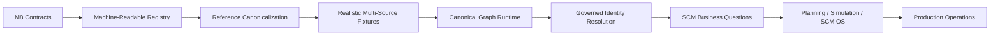
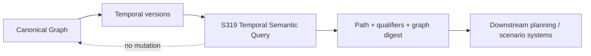

# Post-M8 Implementation Roadmap

M8 completes the semantic and operational contract-definition phase. The next objective is to convert those contracts into a reference implementation and then into SCM business value.

## Current phase — Canonical Graph runtime

**Status: Active — S319**

The post-M8 implementation has progressed from machine-readable vocabulary and explicit reference canonicalization into a governed graph runtime. S311–S314 establish the persistence planning, transport adapter, Neo4j boundary, and temporal relationship persistence contracts. S317 provides temporal semantic path traversal and S318 evaluates those paths against explicit lead-time and capacity constraints.

S319 adds the stable read-only query boundary over that semantic graph:

The query surface is intentionally transport-neutral. It resolves only explicitly represented relationships valid at the requested instant, preserves relationship identity and qualifiers, and returns a deterministic canonical graph digest for query-level provenance.

### Phase 1 — Reference semantic implementation

- [x] machine-readable canonical entity / predicate / relationship registry;
- [x] stable concept references and relationship signatures;
- [x] registry uniqueness and endpoint validation;
- [x] Python registry ↔ machine-readable registry drift detection;
- [x] versioned schema validation for the registry artifact;
- [ ] documentation generated from canonical metadata where practical.

### Phase 2 — Enterprise canonicalization

- [x] realistic ERP/WMS/TMS/APS fixtures;
- [x] explicit source mappings;
- [x] ambiguity and Semantic Gap handling;
- [x] provenance and evidence preservation;
- [ ] governed identity resolution;
- [ ] controlled application into Canonical Fact Versions.

### Phase 3 — Canonical Graph runtime

- [x] governed graph persistence planning;
- [x] transport-neutral graph-store adapter;
- [x] optional injected Neo4j adapter;
- [x] temporal relationship persistence;
- [x] temporal semantic path traversal;
- [x] constraint-aware feasibility reasoning;
- [x] deterministic temporal semantic query boundary;
- [ ] evidence-aware traversal;
- [ ] projection and materialization runtime.

### Phase 4 — SCM value applications

Prioritize questions that demonstrate why a canonical SCM semantic layer matters:

- inventory position across heterogeneous systems;
- demand/supply gap;
- supplier delay impact;
- multi-hop supply risk;
- capacity constraints;
- network disruption propagation;
- plan/actual/commitment reconciliation.

### Phase 5 — SCM OS integration

Connect the semantic layer to planning, simulation, optimization, visualization, and operational workflows while preserving the M8 boundary between derived decisions and Canonical Truth.

## Selection principle

Do not optimize for the largest number of connectors. Optimize for the smallest reference implementation that demonstrates:

**heterogeneous source → governed canonicalization → canonical graph → business question → explainable answer → traceable evidence**.
