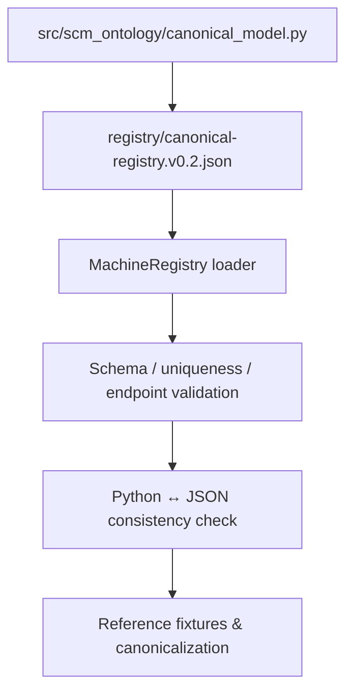

# Post-M8 Implementation Roadmap

M8 completes the semantic and operational contract-definition phase. The next objective is to convert those contracts into a reference implementation and then into SCM business value.

## Current phase — Machine-Readable Canonical Registry

**Status: Active**

The first post-M8 implementation slice makes the existing canonical semantic registry consumable by machines without changing its semantics.

The registry is a **semantic vocabulary artifact**, not a database schema. It exposes stable concept identifiers, layers, worlds, descriptions, relationship predicates, endpoints, and relationship categories while preserving the M8 rule that machine-readable metadata does not itself mutate Canonical Truth.

### Phase 1 — Reference semantic implementation

- [x] machine-readable canonical entity / predicate / relationship registry;
- [x] stable concept references and relationship signatures;
- [x] registry uniqueness and endpoint validation;
- [x] Python registry ↔ machine-readable registry drift detection;
- [ ] versioned schema validation for the registry artifact;
- [ ] documentation generated from canonical metadata where practical.

### Phase 2 — Enterprise canonicalization

- realistic ERP/WMS/TMS/APS fixtures;
- explicit source mappings;
- ambiguity and Semantic Gap handling;
- provenance and evidence preservation;
- governed identity resolution;
- controlled application into Canonical Fact Versions.

### Phase 3 — Canonical Graph runtime

- graph persistence;
- temporal and historical query execution;
- evidence-aware traversal;
- deterministic reasoning;
- explicit result/outcome model;
- projection and materialization runtime.

### Phase 4 — SCM value applications

Prioritize questions that demonstrate why a canonical SCM semantic layer matters:

- inventory position across heterogeneous systems;
- demand/supply gap;
- supplier delay impact;
- multi-hop supply risk;
- capacity constraints;
- network disruption propagation;
- plan/actual/commitment reconciliation.

### Phase 5 — SCM OS integration

Connect the semantic layer to planning, simulation, optimization, visualization, and operational workflows while preserving the M8 boundary between derived decisions and Canonical Truth.

## Selection principle

Do not optimize for the largest number of connectors. Optimize for the smallest reference implementation that demonstrates:

**heterogeneous source → governed canonicalization → canonical graph → business question → explainable answer → traceable evidence**.
